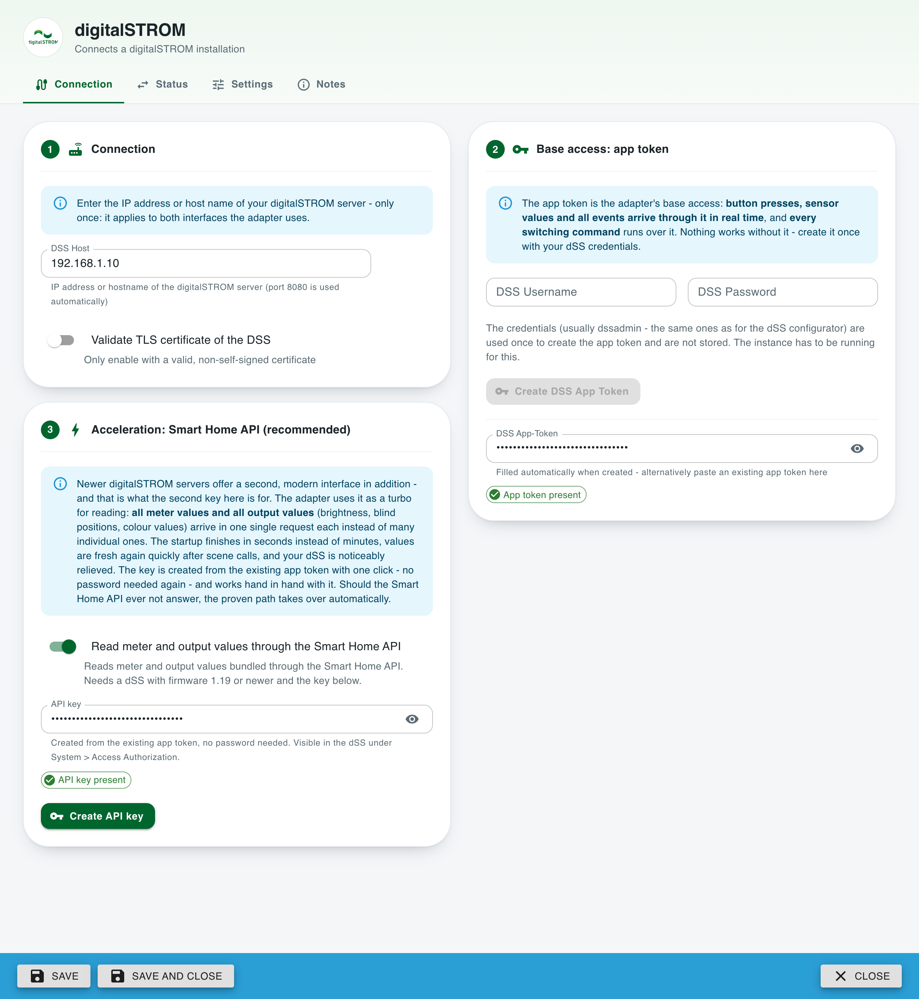
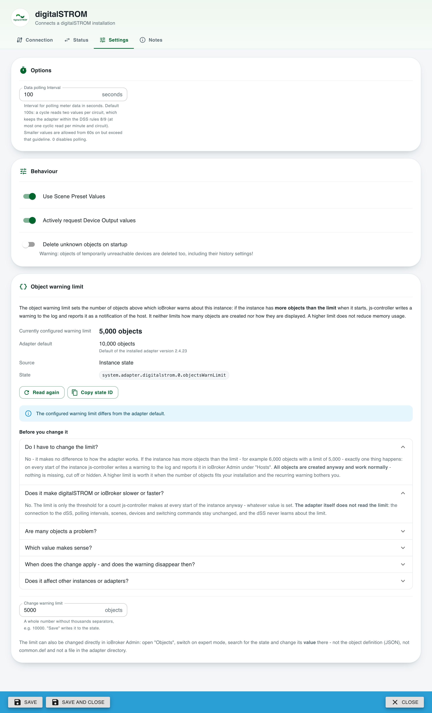

# ioBroker.digitalstrom

**Deutsche Version: [README_de.md](README_de.md)**

## Digitalstrom adapter for ioBroker

Support for digitalSTROM devices via DSS

> This is a maintained fork of [ioBroker/ioBroker.digitalstrom](https://github.com/ioBroker/ioBroker.digitalstrom)
> by Apollon77, which has not been updated since 2021. The original library layer was replaced,
> the admin dialog was migrated to JsonConfig and a large number of runtime bugs were fixed.
> See the changelog for details.
>
> This fork does **not** send any error reports: the Sentry plugin of the original adapter was
> removed, because its reports would have been delivered to a project of the ioBroker organisation
> that this fork has no access to.

## Installation

Please install the adapter via Admin UI as usual.

As soon as the adapter is officially released he will be in the repo and simply selectable.

During test phase, or for testing of newer versions (see relevant forum threads) you can also install the adapter directly from GitHub using https://github.com/mrandreschmitz/ioBroker.digitalstrom as URL. Please use the Admin "Custom Install" option for this.

## Usage

The configuration dialog with the connection settings and the app token:

The polling interval and the behaviour of the adapter sit on the second tab:

After installing the adapter and creating an instance the admin dialog will appear.
First of all you need to enter your DSS IP/Hostname. Then you can choose if you already have manually created an App Token in the DSS Web-Interface or not.
If you do not have an App-Token simply enter your Username and Password to retrieve an App Token automatically.

Additionally to the Authentication settings (see above) you can edit the following settings to your needs:
* **Data Polling Interval**: This is the interval the "Energy Meter" data are requested from your DSM devices. Default 100s, minimum 60s. The digitalSTROM rules 8 and 9 allow at most one cyclic read per minute and circuit. One cycle reads two values per circuit (`getConsumption` and `getEnergyMeterValue`) and the timer for the next cycle only starts once they are answered, so a cycle takes about 20s longer than the configured interval - measured against a real DSS: 60s results in ~1.5 requests per minute and circuit, 100s in exactly 1.0. That is why 100s is the default. Lower values stay possible from 60s on, but they exceed the guideline. Set 0 to disable polling of the energy meter data completely. Invalid values fall back to the default.
* **Use Scene Preset Values**: The Digitalstrom system is not really designed to have the real output values of the devices available all the time and works most with Scenes. For Light and Shader/Blinds some output values are defined for many of the available Scenes. The adapter knows them and when this setting is active the adapter will try to lookup these values when a scene gets triggered and set those values to the states directly. The real values are requested with a delay. This method might deliver wrong values when local priorities are set/used!
* **Request Device Output values actively**: The adapter initializes all device output values on start and also after scenes that are effective for a device. There are delay but in fact all those messages will go over the Digitalstrom bus. If this is problematic for you you can try to deactivate this feature. This option only controls **reading** output values from the DSS - writing (e.g. setting a blind position or angle, or a dimmer value) always works, independent of this setting.
* **Delete unknown objects on startup**: When enabled, all ioBroker objects that are not part of the current DSS structure are deleted on adapter startup. Warning: Objects of devices that are just temporarily unreachable (e.g. a powered-off circuit) are deleted too - including their custom settings like history/InfluxDB configurations! Because of that this option is disabled by default; orphaned objects are then only listed in the log.
* **Validate TLS certificate of the DSS**: By default the certificate of the DSS is not validated because the DSS uses a self-signed certificate. Only enable this if your DSS has a valid certificate. See the security note below.

### Security note about the TLS certificate check

The option **Validate TLS certificate of the DSS** is disabled by default and stays disabled - a digitalSTROM server ships with a self-signed certificate, so enabling validation by default would break every existing installation.

What that means: the connection to the DSS is encrypted, but the adapter does not verify *who* it is talking to. In a local network that you control this is usually acceptable. An attacker who can redirect traffic inside your network (ARP spoofing, a compromised router, an untrusted WLAN) could however place himself between ioBroker and the DSS and would then see the App-Token and every command.

Recommendations, in this order:

1. Keep the DSS and ioBroker in a trusted, separated network segment and do not route the DSS connection over the internet or an untrusted WLAN.
2. If your DSS has a certificate from your own CA or from a public CA (e.g. behind a reverse proxy with a valid certificate), enter that host name and enable the option.
3. Migration path if you want validation with the original self-signed certificate: this needs the certificate itself. The adapter currently supports neither a custom CA file nor a certificate fingerprint - both would be possible technically (`ca` / `checkServerIdentity` of the Node.js TLS agent) and are noted as a possible future enhancement. Until then option 1 or 2 is the way to go.

The App-Token is stored encrypted (`encryptedNative`), is not passed on to other adapters (`protectedNative`), is not written to the log and is shown masked in the admin dialog.

After providing an App token and saving the settings the adapter will restart automatically.

When data are correct the adapter read out the apartment and devices structure and create them as ioBroker Objects. This can take some time (depending on the number of devices and floors/zones/groups and the performance of your system several seconds). Please be patient. And I really mean it that way ... Several thousand objects are easy to reach here! Give the adapter time please!

After this the adapter subscribes to several DSS Events to get notified about actions in the system.

The adapter status light will get green and you will see "Subscribed to states ..." as info log. After this everything is ready and you can e.g.:
* set/undo scenes for apartment, zones, groups or devices
* read state and sensor values; for zones it is also possible to push sensor values
* see the values for Binary inputs, Sensors, Buttons and Outputs

## State and Object structure

The adapter provides two data structures. The Apartment structure with Floors, Zones (Rooms) and Groups and additionally the structure of Circuits/dSMs and the connected devices with their detail data.

In the structures several "types" of data are included:
* Scenes: Scenes are implemented as switches. Setting the value tro "true" will send a "callScene" command for this scene. A value of "false" will send an "undoScene" command for this scene - it is up the the DSS server to decide if "undo" is a valid command! When a callScene or undoScene is triggered as event from the DSS server the relevant scene is set to "true" or "false" with ack=true
* States: States from the system and user defined states via the addon are shown and are read only
* Sensor values are updated when triggered by an event and can partially also bet changed - changes are send a "pushSensorValue" to the server and it is up to the server if the value is accepted! This is mainly relevant for Temperature or Humidity values
* 

### Apartment object and states

For the Apartment a structure with "floor"."zone" is created with the following substructures inside this:
* per device group a sub folder is created including the available group scenes
* scenes for this zone
* states for this zone
* sensor values for this zone

On Apartment level all device groups are available with it's scenes.

On Apartment level also Sensors (also outdoor values), States and user states are included.

### Devices objects and states

The devices are structured with "circuit/dSM"."deviceID" and the subsctructure inside includes:
* Device Scenes, will be triggered for this device only
* Device Sensors, when reported from the system. So values might be empty
* Output values (e.g. state/brightness for Lights and position/angle for Shades/Blinds) are located directly below the device. Only Lights and Shades/Blinds will have a defined functionality for now.
* Buttons and Binary Inputs will also be represented by states and are read only

## Behaviour notes

* **Fast consecutive writes**: If a new value is written to the same output while an older value is still waiting in the request queue, the older one is replaced (last write wins) to respect the DSS request rate limits. The replaced request is reported as "superseded" and its value is never acknowledged as written. A write that is already sent to the DSS is never replaced - the newer value is sent afterwards.
* **Host field**: IP addresses, DNS names, full URLs and IPv6 addresses (in brackets) are accepted. Without an explicit port 8080 is used. Credentials, paths or query strings in the host field are rejected.

## Known Issues / System design effects
* The DSS system mainly works using scenes and not via real device values and also getting the real values is very slow because needs to be fetched via the bus. 
* Values might be empty when they were not reported by the system
* Binary inputs were originally implemented without any hardware to test against. They are confirmed to work in the meantime, with motion detectors and window handles reporting through them. The state keeps the number the DSS reports, so history data stays comparable, but the numbers are named: `inactive`/`active` for a normal binary input, and `closed`/`open`/`tilted` for a window handle, which reports three positions instead of two.
* Meaningful output value reading and writing is only implemented for Ligh (Yellow) and Shade/Blind (Gray) devices.
* I had no chance so far checking how the system behaves with vDCs. So I need logs and details here to add it
* Room temperature control is implemented for the rooms the DSS really regulates: the controller mode and the controller state are read, the operation mode follows the scenes of group 48 and can be set, and the set point of every operation mode is read and writable. Rooms without an active controller deliberately get no such objects.
* Ventilation is covered by the group scenes, the apartment ventilation status and the two boolean output channels (swing mode, auto intensity). Ventilation devices have no dedicated functionality beyond that, because no such hardware was available to test against. Logs and reports are welcome.

## How to report issues and feature requests

Please use GitHub issues for this.

Please use the [issues of this fork](https://github.com/mrandreschmitz/ioBroker.digitalstrom/issues).

Best is to set the adapter to Debug log mode (Instances -> Expert mode -> Column Log level). Then please get the logfile from disk (subdirectory "log" in ioBroker installation directory and not from Admin because Admin cuts the lines). Please add a reference to the relevant GitHub issue AND also describe what should be seen in the log at which time.

## Credits and license

This adapter was originally written by **Apollon77 &lt;iobroker@fischer-ka.de&gt;** and published under the
MIT license at [ioBroker/ioBroker.digitalstrom](https://github.com/ioBroker/ioBroker.digitalstrom).
All credit for the original work belongs to him.

This repository is a fork that continues maintenance from version 2.4.0 on (André Schmitz, 2026).
It is published under the same MIT license; the original copyright notice is kept unchanged in
[LICENSE](LICENSE).

## Changelog

### 2.4.20 (2026-08-31)

* **The power level alias scales correctly.** The live smoke test of 2.4.19 refuted the assumed
  0..100 scale of the `level` field: a switched socket powering a device reported `level: 1` and the
  `powerLevel` state showed "1 %". The field is 0..1 (matching the structure, which normalizes the
  switch threshold to 0..1 as well) and is now scaled and clamped to the 0..100 state

### 2.4.19 (2026-08-31)

* **`info.outputApi` no longer ping-pongs between the two APIs.** On hybrid installations single
  channels the status structurally never delivers (measured live: the outputs of audio devices are
  missing from the status entirely) made the state flip to "classic" about a minute after every
  reconciliation and back with the next one - roughly every five minutes, around the clock. Classic
  reads the sync hands over for such single channels no longer report; "classic" now shows while
  the status request itself fails, while the Smart Home path pauses in its backoff, with the option
  off - or once at adapter start when a generic single-channel device (neither light, shade nor
  joker hardware) delivers its initial value via the deliberately classic read
* **Channels the status never answers are learned** after two exhausted follow-up budgets and go to
  the classic read immediately - their values arrive ~60 s earlier and the pointless follow-up
  status requests (four per trigger, ~59 KB each) stop. A later status answer that carries such a
  channel again heals the learning automatically
* **Two id mismatches of the status are resolved by aliases**, so the affected channels are served
  by the Smart Home API after all: a switched socket (SW-KL200) reports its declared `powerLevel`
  as the `level` field of a `powerState` output, and blinds (GR-KL300) report the single class-64
  shade bank only under the `...Outside` ids although they declare the `...Indoor` channels as
  well - the classic read would have delivered the identical value to both. The `powerLevel` state
  of such sockets gets a value for the first time ever
* The helper states of the dSS window-states addon (`<dsuid>_open-tilded`) log at debug instead of
  info level - the window state itself arrives via the binary input and the device state anyway
* **The status tab shows live what each interface actually did** in the last 10 minutes
  (`info.apiActivity`, published every 30 s): received events and sent commands of the classic API,
  meter and status reads of the Smart Home API and its notifications - the proof that a path really
  works, not just that it is configured

### 2.4.18 (2026-08-31)

* **Device output values can be read through the Smart Home API.** With the option enabled, the
  initial reads at startup and the re-reads after every scene call are served by ONE apartment
  status request (~59 KB, ~100 ms for every device at once) instead of one throttled classic read
  per output channel - the part of the startup that could take minutes on large installations.
  The status delivers each output already in the scale of the ioBroker states, verified offline
  against a real object export: every comparable value matches, and 132 channel states the classic
  path never managed to fill (hue, colortemp, x, y of the lights) finally get their values
* The rules learned from live measurements are built in: an output that is currently **moving
  carries no value** in the status and keeps its last state (asked again after 15 s, at most four
  times, then the classic read has the last word); an answer that was already on its way never
  satisfies a trigger that arrived after it left; boolean channels stay on the classic read; a
  failed status request falls back to the classic reads at once and pauses the Smart Home path for
  five minutes. With the option off, the values behave exactly as before - the only difference is
  that requests which never worked are no longer sent (a light's colortemp read always went out
  broken and only ever produced a warning)
* **The new-API client cannot hang any more.** A connection dying in the middle of a response body
  used to leave the request pending forever - no error, no retry. The classic client always had
  this handler, the new one was missing it. A wrong password during key creation now surfaces the
  actual answer of the dSS instead of a generic sentence
* **The API key dialog uses the app token from the form.** Creating the app token and the API key
  in one visit used to fail with "Please create or enter the App-Token first", because the instance
  only knew the SAVED token. A stored API key that does not look like one (typically: js-controller
  could not decrypt it after a backup restore) is called out at startup instead of an anonymous
  HTTP 401, and a dSS without /api/v1 (HTTP 404) backs off to the maximum right away and says so
  once instead of warning every hour
* Groundwork hardening of the notification websocket (still unused): dead connections are detected
  by pinging after 30 s of silence and reconnecting after 90 s, fragmented messages are capped in
  total size, and the debounce defaults follow the measured reality (5 s coalescing, 15 s maximum)
* **The notification websocket is now used - as a deliberately throttled safety net.** Every meter
  tick fires a payload-free notification (measured: 17 in 75 seconds), while buttons and scenes are
  already reported precisely by the classic events. A notification therefore triggers a
  reconciliation of all output values at most every five minutes: it catches what happens past
  ioBroker - a third-party app writing an output directly - without adding steady load. The channel
  reconnects on its own, and a dSS without it changes nothing
* **Each status answer also refreshes the room temperature control of every zone** - setpoint and
  control value, verified degree- and percent-identical against a real installation; the operation
  modes stay with the classic path. And the scene names given in digitalSTROM are loaded once from
  the new API to fill the gaps the classic naming leaves
* **The settings explain the hybrid approach and show it working.** The connection tab walks
  through three numbered steps - server address (entered once, it serves both interfaces), the app
  token as the base access in its natural order (credentials first, the created token lands below),
  and the Smart Home API key as the accelerator - side by side on a PC screen. A new status tab
  shows the division of labour live: which interface currently delivers events, meter values and
  output values, backed by the new state `info.outputApi`, the counterpart of `info.meteringApi`

### 2.4.15 (2026-08-30)

* **The dialog scrolls by itself now.** It used `minHeight: 100%` and relied on the surrounding frame
  to provide the scrolling. Where that frame does not scroll, everything below the first screen height
  was unreachable and the lowest button stayed under the save bar - which is why more bottom spacing in
  2.4.12 and 2.4.14 did not help. With `height: 100vh` and its own `overflow-y` the content is reachable
  in either case; verified against a deliberately non scrolling frame, 71 px clear below the last button

### 2.4.14 (2026-08-30)

* **The meter values can optionally be read through the new Smart Home API.** One request for all
  circuits instead of two per circuit - measured on a dSS 1.19.13 with six circuits: 12 requests in
  734 ms become one in 114 ms, which takes the steady load of this adapter from about 8.7 to about
  2.1 requests per minute
* The switch is **off by default** and every failure falls back to the classic API, so nothing changes
  until it is turned on. The API key is created from the EXISTING app token, no password is needed
  again
* Values and states stay identical. Both APIs were compared against each other beforehand: five of six
  circuits matched to the watt second, the sixth differed by exactly the time between the two reads.
  The unit is watt seconds, so the conversion `value / 3600 / 1000` is unchanged - note that the API
  declares `Wh`, which is demonstrably wrong and would have been off by a factor of 3600

### 2.4.13 (2026-08-30)

* **One long-poll instead of nine.** `subscribeEvents()` gave every event name its own
  subscription id, so nine `event/get` long-polls were open at the same time, each of them
  re-established every 40 seconds. The DSS allows many event names on ONE subscription id -
  that is what openHAB and the Home Assistant integrations do - and answers all of them
  through a single `event/get`. All events now share the id from the configuration (42 by
  default), which removes the biggest steady load the adapter put on the DSS. Nothing about
  the events themselves changes
* Two details follow from that: a re-subscribe after a failed poll registers **every** name of
  the channel again, because the DSS loses the whole subscription id and not just the one name
  whose poll failed; and the polling only starts after the last subscription, so no event can
  be missed while a subscription is still on its way. Unsubscribing at the end is one request
  instead of nine
* The lowest button of a tab needed more room below the save bar of the admin than 2.4.12 gave
  it. The design preview (`npm run dev:admin`, `preview.html`) now shows a stand-in of that bar
  so the spacing can be checked without the admin
* New: `scripts/probe-smarthome-api.js` reads a DSS through the new Smart Home API
  (`/api/v1` plus the notification websocket) and writes every answer to a directory. It is the
  groundwork for the decision whether the adapter can be moved to that API

### 2.4.12 (2026-08-30)

* **The app token was decrypted twice.** It was named in the `encryptedFields` option of
  `GenericApp` and, at the same time, in `encryptedNative` of io-package.json - and
  `onPrepareLoad` decrypts its own list plus the fields of `encryptedNative`. Decrypting twice
  returns the ciphertext, so the dialog would have shown an unusable value and saving from
  there would have stored a token the adapter cannot use. `encryptedNative` alone is
  authoritative now, and a test makes sure the field is not declared in both places again
* The lowest button of a tab sat directly underneath the save bar of the admin, which is fixed
  to the bottom edge. The content keeps room below it now

### 2.4.11 (2026-08-30)

* **Fixed a configuration dialog that could not connect.** The React dialog introduced in
  2.4.10 only reported `Socket connection could not be initialized: Error: Socket library could
  not be loaded!` and stayed empty. `@iobroker/socket-client` does not bring socket.io along,
  it expects the page to have loaded it as a global - admin serves it at
  `/lib/js/socket.io.js`. The page loads it now and offers `registerSocketOnLoad`, so the
  client is told when the library is there instead of polling for it. A test checks both,
  because the dialog is unusable without them and nothing else notices

### 2.4.10 (2026-08-30)

* **The configuration dialog is a React application of its own now.** jsonConfig describes a
  form, it does not design one - headers were rendered as full width bars in the primary colour
  of the admin theme, and the colours set for them only ever reached the text. The dialog is
  written directly instead: a light surface independent of the admin theme, raised cards per
  topic, a header with the adapter icon and tabs with icons. The app token can be revealed and
  says whether it is stored. Sources live in `src-admin`, the build lands in `admin` and is
  committed, because the adapter is installed straight from this repository. All eleven
  languages were taken over from the former `admin/jsonConfig.json`, nothing was translated
  anew. `npm run build:admin` builds it, `npm run dev:admin` serves `preview.html` for looking
  at the layout, and the workflow rebuilds the bundle and fails if it differs from the
  committed one
* This also removes a whole class of error: the credentials for creating an app token used to
  travel through a JavaScript template literal in `jsonData`, where a quote in a password could
  break the message. They are now passed as a plain object. The 43 tests that guarded the
  jsonConfig and that escaping were dropped, 6 new ones check the built interface, the
  agreement of the eleven translation files and that every text the dialog asks for exists
* **Binary inputs name their values.** The state kept the bare number of the DSS, so a window
  handle read 1, 2 or 3 without anything saying what that meant. Observed on an EnOcean window
  handle (F6-10-00), each position checked against the readable device state of the same
  handle: closed 1, open 2, tilted 3. Every other binary input keeps two values, 1 inactive and
  2 active. The type stays `number`, so existing history data remains comparable
* Dependency updates: `@apollon/iobroker-tools` 0.3.0, `actions/checkout` 7,
  `actions/setup-node` 7, `@types/node` 26, `@types/sinon` 22, `@types/proxyquire` 1.3.31,
  `@alcalzone/release-script-plugin-license` 5.2.2. chai 6, sinon-chai 4, chai-as-promised 8
  and TypeScript 7 were deliberately not taken: the chai family is ESM only, which the type
  check of a CommonJS project rejects, and `@typescript-eslint` pins TypeScript below 6.1

### 2.4.9 (2026-08-30)

* **Fixed an invalid admin configuration.** The two dividers of the layout introduced in 2.4.5
  carried a colour of the digitalSTROM palette, but the schema only allows `primary` and
  `secondary` for that property. admin therefore rejected the whole config with
  `digitalstrom has an invalid jsonConfig` and fell back to a generic dialog. The colour now
  lives in `style`/`darkStyle`, where a free colour is allowed. Two new tests check the enum
  constrained properties of the schema, so this class of error cannot come back unnoticed
* The release workflow of this fork no longer tries to publish to npm - the package name
  belongs to the upstream project. A pushed tag `v<version>` now only creates the GitHub
  release, and its text comes from the message of the annotated tag

### 2.4.8 (2026-08-30)

* Removed the App-Token migration note from the admin dialog and from the readme. No public
  release ever shipped the misplaced `encryptedNative` declaration, so a permanent hint about
  a migration nobody has to do would only confuse. The adapter still detects a token it cannot
  read back and says so in the log, now without referring to a version history

### 2.4.7 (2026-08-30)

* **The default data polling interval is 100s instead of 60s.** Measured against a productive
  installation with 6 metering circuits: a cycle reads two values per circuit
  (`getConsumption` + `getEnergyMeterValue`) and the timer for the next cycle only starts once
  both are answered, so a cycle takes roughly 20s longer than the configured interval. With 60s
  that resulted in a measured 1.53 requests per minute and circuit - one and a half times what
  the digitalSTROM rules 8/9 allow. 100s gives a cycle of about 120s and therefore exactly 1.0.
  The claim in 2.4.4 that 60s complies with those rules counted only one read per cycle and was
  wrong. The minimum stays at 60s: lower values remain possible, they are now just honestly
  documented as exceeding the guideline instead of being called compliant

### 2.4.6 (2026-08-30)

Built from the object export and the debug log of a productive installation.

* **Room temperature control.** Every room the DSS really regulates gets a channel
  `temperatureControl` with `ControlMode` (which kind of controller), `ControlState` (who
  owns the set point) and `OperationMode` - a readable, writable mirror of the group 48
  scenes that follows every scene call. Rooms with `ControlMode: 0` deliberately stay
  without those objects, so it is visible at a glance which rooms are regulated at all
* **Set points per operation mode.** They are read with `zone/getTemperatureControlValues`
  and written with `zone/setTemperatureControlValues`. The field names are taken from the
  answer instead of being hard coded, and the states are only created when the DSS really
  answered - a firmware without that endpoint gets no set point objects rather than dead ones
* `NominalValue` stays writable but only takes effect when the zone is under external
  control (`ControlState` = external). With the internal controller the DSS overwrites the
  pushed value - use `OperationMode` or the set points instead
* **Cluster states.** `cluster.<id>.user_lock` and `cluster.<id>.operation_lock` had no
  object at all, although the group folder of the cluster exists. They are created below
  `apartment.groups.<id>.states` now
* **Group states with a dot in their name.** `status.malfunction` and `status.service` of
  the ventilation groups were dropped by a pattern that only matched a single segment. They
  are created as nested states now, including the channel in between
* The check for rooms that belong to no floor evaluated `isValid` as a plain truthiness
  check. A real DSS does not send that flag for a zone at all, which silenced the check
  completely. It now only skips a zone that the DSS explicitly marks as invalid or as not
  present (`isPresent: false`, e.g. the dS zone 65534 for unassigned devices)

### 2.4.5 (2026-08-30)

* Redesigned the admin configuration. The options are split into the tabs **Connection**,
  **Settings** and **Notes** instead of one long page, with section headers, info boxes and
  switch cards in the digitalSTROM colours (`#00662E` / `#7FC241`, taken from the logo)
* The new **Notes** tab explains the certificate check
* No option was renamed and none was dropped - existing instance settings are taken over
  unchanged. A test now asserts that every option of `native` still has a control

### 2.4.4 (2026-08-14)

Found by a systematic multi-agent review of the whole adapter. All of these defects already
existed in 2.4.2 and earlier - they fail silently, which is why they never showed up as an error.

* **A scene called for a whole room never reached the device handlers.** `zoneDevices` is only
  keyed by the real device groups (1, 2, 8 ...), never by the broadcast group 0, so the fan-out
  found nothing - and the forwarding loop that runs afterwards is marked as "forwarded", which
  disabled it as well. Effect: after every "room off" the states `brightness`,
  `shadePositionOutside` and `shadeOpeningAngle*` kept their old value until the next group
  scene hit the same device or the adapter restarted, without a single log line. The adapter
  triggers this case itself: its own room scene states send `zone/callScene` without a groupID
* **The App-Token is now really stored encrypted.** `encryptedNative` and `protectedNative` were
  declared inside `common` instead of at the root of io-package.json, where `ioBroker.AdapterObject`
  expects them. Neither took effect, so the token was kept in plain text in the object database,
  was readable by every other adapter and was contained in every backup in the clear.
  **Migration:** a token that was saved by an older version cannot be decrypted and is read back
  as garbage. Open the adapter configuration once, enter the App-Token again (or create a new one
  with your DSS login) and save. The adapter now detects this case and says exactly that instead
  of only reporting a failed login
* **Every press of the first button was dropped on some devices.** The state of button 0 was only
  created for `buttonActiveGroup` 1..8, while the click type and hold count states of the same
  button were always created - and the event handler aborts when the plain button state is
  missing. On a keypad whose button is unassigned, on broadcast, or in a group above 8, buttons
  2..n worked while button 1 only produced `INVALID Button click`
* Button click type and hold count were written with the raw DSS string into a state declared as
  a number, so js-controller warned on every press and the `states` mapping did not resolve
* `EXTRANOUS ZONE found <id>` was logged for every regular room at every adapter start: the check
  ran synchronously while the rooms are processed through `setImmediate`, so its bookkeeping was
  still empty
* **"Request device output values actively" = false suppressed the scene preset values as well.**
  The option is documented to control only the reads; the preset values belong to "Use scene
  preset values". The gate sat in front of the device handler instead of in front of the read
* The output channel `shadePositionIndoor` was named "Shade Position **Outside** (curtains)".
  Existing objects keep their old name - ioBroker preserves the name on update

### 2.4.3 (2026-08-12)

**Runtime fixes**
* Event recovery could hang forever: a successful `event/subscribe` reset the error counter, so a DSS that accepted the subscription but answered every `event/get` with HTTP 500 never reached the error limit. The adapter stayed green and re-subscribed every two seconds without ever processing an event again. The counter is now only cleared by a really successful `event/get`, the backoff grows and the defined `eventError` / restart path is reached reliably
* The stop is a real barrier now: asynchronous startup callbacks that finish during or after the unload no longer create timers, requests, state subscriptions or `connected = true`, `DSS.requestAsync()`/`httpRequest()` reject every request after `stop()`, and a still running App-Token dialog is tracked and closed by the unload (no late `sendTo` and no late log lines from that flow)
* **Request Device Output values actively = false** disabled the whole blind control: detection of position/angle, the write handlers and the initial read were in one block, so with the option switched off no write command reached the DSS at all. Writing is now independent of the option, which only controls whether output values are *read* (initially and after scene events, for blinds and lights alike)
* Scene 22 and scene 25 were both called "Preset 24" and therefore shared one state id. The remaining handler controlled scene 25, scene 22 was not reachable. Scene 22 is called "Preset 14" again (as the code comment already said) and a test now checks all generated scene state ids for uniqueness
* Queue coalescing is re-entrant: the queue entry is replaced *before* the superseded callbacks run. A value that is enqueued synchronously from a superseded callback (typical for a moving slider) is no longer overwritten by the older call. Guaranteed: the newest value is sent exactly once, a replaced value is never sent, every callback finishes exactly once, no callback is lost
* A superseded write is no longer reported as a warning. The message `Error while set State for apartment-user: SupersededError: ... was superseded by a newer value` was normal last-write-wins coalescing, not a DSS error. Expected queue cancellations are now classified centrally (`DSSQueue.isExpectedQueueError`) and only logged at debug level for all consumers (apartment, apartment-user, circuit, device output, zone, group). Real network, DSS and response errors still produce a warning
* Events could get lost during startup: the handlers were only registered after *all* subscriptions were done, while every single subscription starts polling as soon as it succeeded. The handlers are now registered before the first poll can emit anything (and never twice). In addition the artificial two second wait before subscribing was removed, and once the subscription is active the last called scenes are checked once with the lowest priority so scene calls during a long startup are applied afterwards

**Further fixes**
* The boolean output channels `airLouverAuto` (ventilation swing mode) and `airFlowAuto` (ventilation auto intensity) accepted only numbers and rejected `true`/`false` - they are switchable again and are sent to the DSS as 0/1. Invalid types are still rejected in a controlled way
* The apartment ventilation status (sensor 60) was created as a boolean, which turned every status code other than 0 into `true`. It is a numeric state again and keeps all DSS status codes (0 = OK, 2 = Malfunction, 4 = Service, 6 = Malfunction+Service)
* Heating and ventilation groups activated the generic scene state (e.g. `Preset0`) on startup while every event toggled the special one (e.g. `HeatingOff`). The initial state is now resolved via the state map, exactly like the event handling does
* Apartment specific cluster names no longer leak between adapter instances: every structure gets its own copy of the group type map and the module constants are never modified at runtime
* Host normalization: an explicitly configured default port was replaced by the DSS default port 8080 when the host ended with a slash (`https://dss.local:443/` became `https://dss.local:8080`, the same for `http://...:80/` and IPv6). Fixed for host names, IPv4, IPv6, with and without trailing slash
* A request timeout produced by the adapter itself now carries a structured marker (`code: 'ETIMEDOUT'`), so the retry classifier recognizes it and a safe read is repeated once. Write requests are still never repeated
* `apartment/getReachableGroups` (a pure startup read) may be repeated once after a connection error

**Configuration and maintenance**
* The minimum data polling interval is 60s now instead of 10s. digitalSTROM rules 8/9 allow at most one cyclic read per minute and circuit, and one cycle already issues several measurement reads per circuit. Configured values between 1 and 59 are raised to 60s, 0 still disables polling completely. **If you configured a value below 60s, the effective interval changes with this update**
* The App-Token is no longer displayed as plain text in the admin dialog (it was already stored encrypted and protected)
* CodeQL updated from the unsupported v2 to v4
* Node.js 22 is the minimum required version (Node 20 is end of life), CI and release run on Node 22 and 24
* The Dependabot auto-merge workflow was hardened: it no longer checks out pull request code, runs only for pull requests really opened by Dependabot, uses the automatically provided `GITHUB_TOKEN` with minimal permissions instead of a personal access token, and pins the official `dependabot/fetch-metadata` action to a full commit SHA. Merging now happens through GitHub auto-merge, so required checks have to pass first. The policy became stricter: production dependencies only for patch updates, development dependencies for patch and minor updates
* The whole project is free of type errors now: `npm run typecheck` (`tsc --noEmit` with `strict` and `checkJs`) runs in CI and must stay green. All types are declared with JSDoc - no suppressions, no weakened compiler options
* DSS states that belong to no device, circuit, room, group or the apartment are reported once with their exact name instead of silently having no object at all
* Dev dependency updates: 0 known vulnerabilities at all. The findings in mocha and @iobroker/testing are fixed through npm `overrides` (serialize-javascript, diff, esbuild) instead of downgrading the test tooling

### 2.4.2 (2026-08-02)
* Do not use HTTP keep-alive anymore. The DSS closes idle connections, which caused sporadic "socket hang up" errors on the next request (2.3.0 did not use keep-alive either)
* Add the missing role to the binary input states (no more "property common.role missing" warnings)
* Map boolean states via the value mapping reported by the DSS and understand the usual off words (off/inactive/no/0) instead of turning every non-empty string into true
* Convert values delivered by the DSS to the type declared for the object. The DSS reports numbers as strings, which produced "has to be type number but received type string" messages for sensor values, scene ids and states
* Retry a **read** request once when the connection was closed without an answer ("socket hang up"). Actions with side effects (`callScene`, `undoScene`, `event/raise`, `state/set`, `pushSensorValue`, output writes) are never repeated automatically - after a connection error the DSS may already have executed them, so a repeat could trigger the scene or an external automation a second time
* Do not write state values before the corresponding objects exist (no more "has no existing object" warnings during startup)
* Log unsupported output channels (e.g. the media channels of dS audio devices) at debug/info level instead of flooding the log with warnings
* Use a separate connection pool for the event long-polls. With 9 parallel long-polls the shared pool (4 sockets) could block every normal command like a scene call indefinitely
* Fix the request queue merging two writes to the same output: a newer value could be acknowledged although only the older value was sent to the DSS. Now the newest pending value wins, an already running write is no longer overtaken, and a replaced write is reported as superseded instead of successful
* Isolate queue callbacks: a throwing callback no longer stalls the request queue of that circuit
* Rework the event retry handling: polling and re-subscribe errors now share one bounded exponential backoff with a single timer per event and reliably end in the defined error path
* Report failed event subscriptions during startup instead of continuing with a green connection indicator without any events
* Normalize DSS events defensively - an event without source/properties, an unusable entry or a throwing handler no longer ends the polling loop
* Remove the `process.exit()` fallback so the adapter can never terminate the shared host process in compact mode
* Make stopping fully idempotent: every caller is answered exactly once, the DSS client and its agents are closed even if unsubscribing hangs, and running requests are aborted
* Close the temporary DSS client of the App-Token creation in every case
* Accept and validate all common host formats (IP, DNS name, URL, IPv6 with and without port) and reject credentials, paths or query strings in the host field
* Keep `clickType: 0` ("Single Tip") instead of turning it into -1
* Resolve the initial zone scene via the zone scene names as well, so room scenes are marked correctly and unknown scenes no longer produce an "undefined" state path
* Validate the polling interval independently of the admin UI - invalid values can no longer create an aggressive timer, and 0 now really disables polling
* Fix the legacy call signature of `queueSetOutputValue()` which could send the priority string as output value
* Give the meter states a `type` and interpret written booleans correctly (the strings "false"/"0" are no longer treated as true)
* Migrate the admin configuration to JsonConfig (replaces the deprecated Materialize UI, works in current and future admin versions)
* Automatically re-initialize when the DSS reports a changed apartment model (`model_ready` event) - structure changes and DSS restarts are now picked up without a manual adapter restart
* Migrate to ESLint 9 with @iobroker/eslint-config and Prettier, remove the gulp based build tooling
* Add real unit tests for the DSS client, the request queue and structure helpers
* Replace the unmaintained ds-wrapper library with an own implementation based on native Node.js https. This removes the deprecated `request` dependency including known vulnerabilities (CVE-2025-7783 in form-data, CVE-2023-26136 in tough-cookie)
* Add timeouts to all DSS requests. Hanging requests could previously block the command queue of a circuit, stop the meter data polling and freeze event polling forever
* Treat DSS error responses (`ok: false`) as errors. Previously a lost event subscription (e.g. after a DSS restart) resulted in a tight polling loop without events ever arriving
* Fix the event polling error counter (`x = x++` bug) so re-subscription and adapter restart actually happen after repeated errors
* Fix error propagation of failed event subscriptions on startup (failures were silently swallowed and the adapter pretended to be connected)
* Do not delete objects of devices that are unknown/unreachable during startup anymore. This previously destroyed history/InfluxDB configurations. Deletion is now an opt-in via the new "Delete unknown objects on startup" setting
* Store the App-Token encrypted (`encryptedNative`/`protectedNative`) and do not write it to the log anymore
* Change the admin password field to a real password input
* Remove the `uncaughtException` handler. Crashes now properly terminate the adapter so js-controller can restart it (previously the adapter stayed alive as a zombie doing nothing)
* Set `info.connection` to `false` when all meter requests fail, so a dead DSS connection becomes visible
* Add a startup watchdog: if initialization does not finish within 10 minutes the adapter restarts
* Route `getReachableScenes` startup requests through the request queue instead of firing them all at once
* Add optional TLS certificate validation ("Validate TLS certificate of the DSS" setting, off by default because the DSS uses a self-signed certificate)
* Fix operator precedence bugs in the UMV min/max handling and the shade angle update
* Fix `states` definition of buttonClickType objects so the click type labels are shown in admin
* Fix last-scene tracking for group undoScene calls
* Skip `undefined` initial values to avoid js-controller warnings
* Clear pending queue entries and timers properly on adapter stop
* Normalize all boolean settings centrally. A value stored as the string `"false"` (e.g. from a script or a restored backup) was treated as true - for "Delete unknown objects on startup" that could have deleted objects including their history settings
* Handle an invalid host without crashing: neither the adapter start nor the App-Token dialog throws anymore, the dialog gets a proper error message and the adapter waits for a corrected configuration instead of restarting in a loop
* Give every adapter instance its own object helper. In compact mode two instances shared one helper, so the instance started last received the object and state writes of the other one
* Stop the request queue on unload. A control command arriving during the shutdown could otherwise queue new work and create a new timer after the DSS client was already closed
* Insert the login data of the App-Token dialog JSON safe. Passwords containing quotes, backslashes, line breaks or tabs broke the request
* Do not log the DSS username anymore
* Report a device that does not deliver an output value (e.g. a blind without tilt) once instead of warning after every scene - the value is re-read after each scene call
* Report requests aborted by the adapter stop as debug instead of flooding the log with warnings
* Update dependencies, remove manual Sentry integration (handled by the js-controller plugin), require Node.js >= 20, js-controller >= 6.0.11 and admin >= 7.6.17

### 2.3.0 (2021-08-01)
* (Apollon77) Add support for use defined properties on apartment level

### 2.2.1 (2021-07-26)
* (Apollon77) Optimize for js-controller 3.3
* (Apollon77) Optimize get/set Value handling for new devices

### 2.2.0 (2021-04-16)
* (Apollon77) Add support for integrated (IC) devices (SW, GE, GR)

### 2.1.0 (2021-04-13)
* (Apollon77) prevent crashes (Sentry IOBROKER-DIGITALSTROM-5)
* (Apollon77) Fix EnergyMeterValue
* (Apollon77) further optimizations and adding new outout channel types

### 2.0.5 (2020-03-14)
* (Apollon77) BREAKING: binaryInput are now numbers intead of booleans because it can have values other then true/false
* (Apollon77) BREAKING: Some states are converted to strings to allow all values to be passed
* (Apollon77) Fixes on some outputValues 
* (Apollon77) add new sunelevation and sunazimuth values 

### 1.0.2 (2020-02-10)
* (Apollon77) trigger buttons on scene calls also if scene is normally not allowed but came from the device
* (Apollon77) fix button logic
* (Apollon77) also add sensor type 255, but without name and unit because unknown
* (Apollon77) Switch Sentry to iobroker own instance hosted in germany
* (Apollon77) user states are optional now
* (Apollon77) add button states for devices wth more then 1 button

### 1.0.0 (2020-01-31)
* (Apollon77) bump version to 1.0.0
* (Apollon77) update dependecies
* (Apollon77) change default loglevel to info

### 0.5.5 (2020-01-29)
* (Apollon77) fix smaller errors
* (Apollon77) send Sentry reports to own server

### 0.5.0 (2020-01-19)
* (Apollon77) add buttons for more device types (also vDC) and try to detect button triggers

### 0.4.10 (2020-01-19)
* (Apollon77) state changes added
* (Apollon77) Fixed shade position control

### 0.4.9 (2020-01-18)
* (Apollon77) add unknown weather sensor "windgust"
* (Apollon77) change handling of Input types
* (Apollon77) Fix controlling of shaders 

### 0.4.7 (2020-01-17)
* (Apollon77) fix error when writing vdc output values

### 0.4.6 (2020-01-17)
* (Apollon77) fix missing datatypes for some states (mainly sensors and output values)

### 0.4.5 (2020-01-17)
* (Apollon77) fix error in sentry reporting

### 0.4.4 (2020-01-17)
* (Apollon77) fix error (Sentry IOBROKER-DIGITALSTROM-7)

### 0.4.2 (2020-01-16)
* (Apollon77) fix wrong scene state updates if same scene is triggered twice
* (Apollon77) also trigger scene update for all groups if scene was called on zone or to all zones and groups when done on apartment

### 0.4.1 (2020-01-16)
* (Apollon77) also add basic scenes to room groups

### 0.4.0 (2020-01-15)
* (Apollon77) add userActions as states and allow to trigger the actions

### 0.3.3 (2020-01-15)
* (Apollon77) fixes for scene lists
* (Apollon77) add some special szenes to more groups 

### 0.3.2 (2020-01-14)
* (Apollon77) fixes for adapter start

### 0.3.1 (2020-01-14)
* (Apollon77) fixes
* (Apollon77) make sure to initialize scenes, states and sensors really on startup - values will be overwritten if delivered with ack=true!
* (Apollon77) add all Presets (0-44) to Room/Zone and Group states 
* (Apollon77) also for unknown device types try to initialize output value IF only one is there (assuming it is offset/index 0!) Please check and report back!
* (Apollon77) make some initial processing async to block eventLoop less

### 0.3.0 (2020-01-14)
* (Apollon77) further optimize (lower) delays and timeouts, please give feedback!
* (Apollon77) add "stateId" State for each scenes folder with the scene number. This is updated with the scenes and also controllable.
* (Apollon77) scenes will not be cleared at the beginning and initialized with the "lastSceneId" returned from DSS; initialization may take some seconds longer!
* (Apollon77) update dependencies
* (Apollon77) increase loglevel of some "invalid cases" to warn to better see if they happen
* (Apollon77) fix handling of binaryInput events

### 0.2.2 (2020-01-13)
* (Apollon77) optimize event subscription logic and timeouts (should prevent "error 500 cases", now tries to resubscribe)

### 0.2.1 (2020-01-13)
* (Apollon77) optimize brightness handling
* (Apollon77) optimize error and reconnection handling

### 0.2.0 (2020-01-12)
* (Apollon77) initial official testing release (still GitHub)

### 0.1.x
* (Apollon77) initial release and finalization

## License
MIT License

Copyright (c) 2020-2021 Apollon77 <iobroker@fischer-ka.de>

Permission is hereby granted, free of charge, to any person obtaining a copy
of this software and associated documentation files (the "Software"), to deal
in the Software without restriction, including without limitation the rights
to use, copy, modify, merge, publish, distribute, sublicense, and/or sell
copies of the Software, and to permit persons to whom the Software is
furnished to do so, subject to the following conditions:

The above copyright notice and this permission notice shall be included in all
copies or substantial portions of the Software.

THE SOFTWARE IS PROVIDED "AS IS", WITHOUT WARRANTY OF ANY KIND, EXPRESS OR
IMPLIED, INCLUDING BUT NOT LIMITED TO THE WARRANTIES OF MERCHANTABILITY,
FITNESS FOR A PARTICULAR PURPOSE AND NONINFRINGEMENT. IN NO EVENT SHALL THE
AUTHORS OR COPYRIGHT HOLDERS BE LIABLE FOR ANY CLAIM, DAMAGES OR OTHER
LIABILITY, WHETHER IN AN ACTION OF CONTRACT, TORT OR OTHERWISE, ARISING FROM,
OUT OF OR IN CONNECTION WITH THE SOFTWARE OR THE USE OR OTHER DEALINGS IN THE
SOFTWARE.