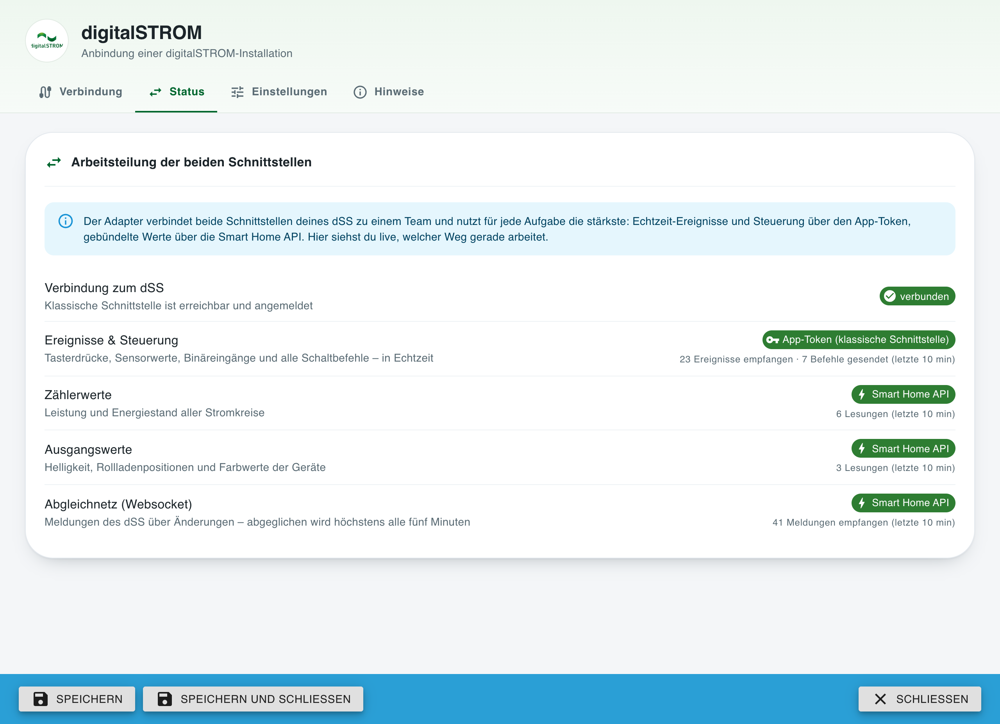
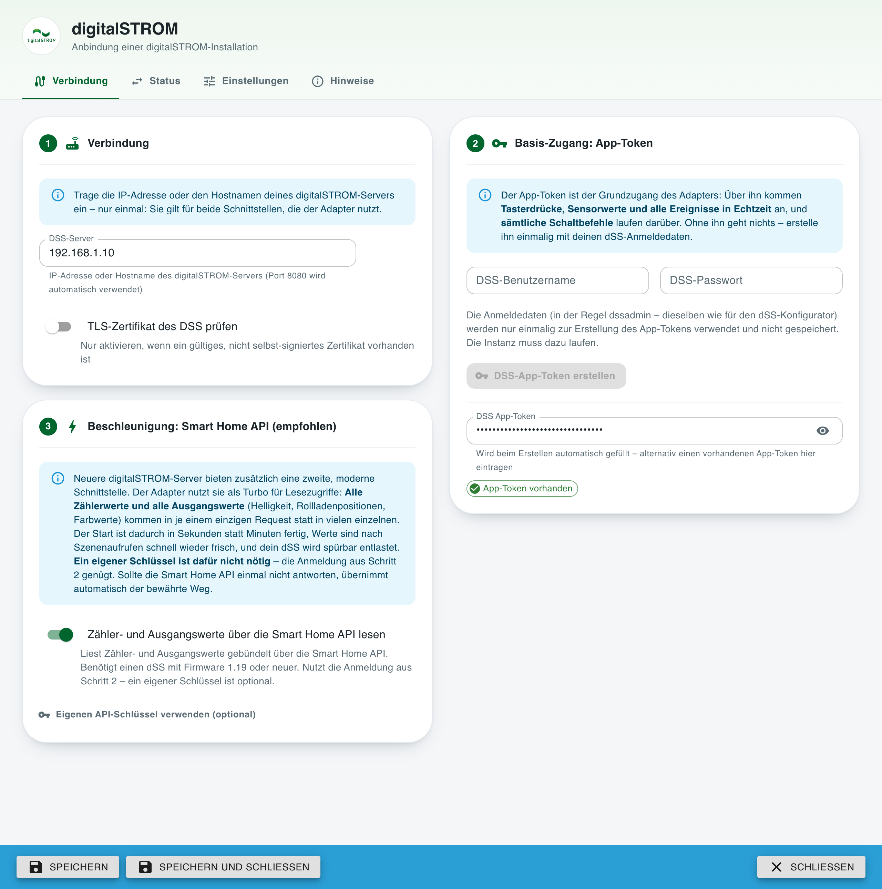
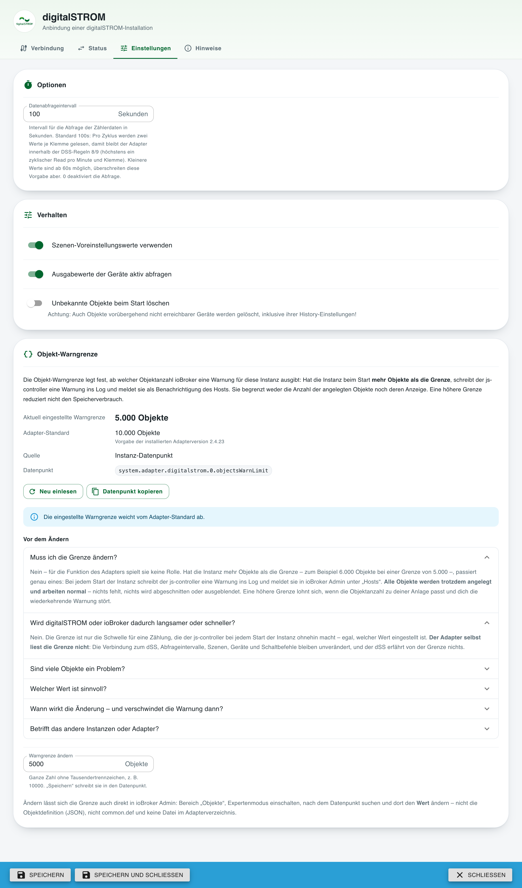
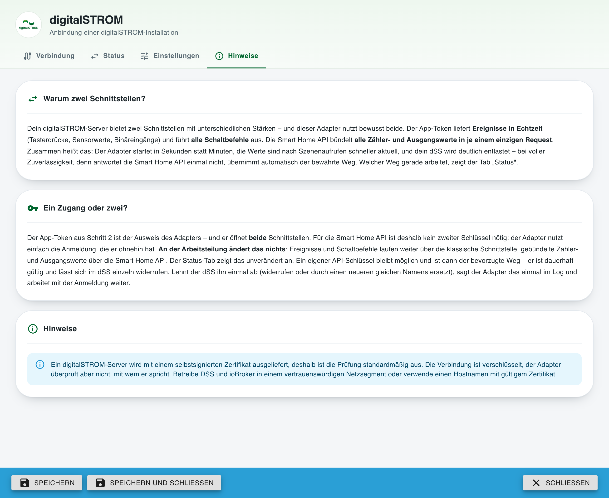

# ioBroker.digitalstrom

**English version: [README.md](README.md)**

## Digitalstrom-Adapter für ioBroker

Anbindung von digitalSTROM-Geräten über den DSS (digitalSTROM-Server)

> Dies ist ein gepflegter Fork von [ioBroker/ioBroker.digitalstrom](https://github.com/ioBroker/ioBroker.digitalstrom)
> von Apollon77, der seit 2021 nicht mehr aktualisiert wurde. Die zugrunde liegende Bibliotheksschicht
> wurde ersetzt, der Admin-Dialog neu gebaut, neben der klassischen Schnittstelle wird die moderne
> Smart Home API des dSS genutzt und eine größere Zahl von Laufzeitfehlern behoben.
> Einzelheiten stehen im Changelog.
>
> Dieser Fork sendet **keine** Fehlerberichte: Das Sentry-Plugin des Originaladapters wurde entfernt,
> weil dessen Berichte in einem Projekt der ioBroker-Organisation gelandet wären, auf das dieser Fork
> keinen Zugriff hat.

## Installation

Die Installation erfolgt wie gewohnt über die Admin-Oberfläche.

Zum Testen neuerer Versionen kann der Adapter auch direkt von GitHub installiert werden. Verwende dazu
in Admin die Option „Beliebig / Custom Install" mit der URL
https://github.com/mrandreschmitz/ioBroker.digitalstrom.

## Zwei Schnittstellen, ein Team

Ein digitalSTROM-Server bietet zwei Schnittstellen mit unterschiedlichen Stärken — und dieser
Adapter nutzt bewusst beide als Team:

* Die **klassische Schnittstelle** (App-Token) ist der Basiszugang des Adapters: Tasterdrücke,
  Sensorwerte und Binäreingänge kommen als **Ereignisse in Echtzeit** an, und **jeder
  Schaltbefehl** läuft über sie.
* Die **Smart Home API** (`/api/v1`, dSS-Firmware 1.19 oder neuer) ist der Lese-Turbo:
  **alle Zählerwerte und alle Geräte-Ausgangswerte** (Helligkeit, Rollladenpositionen, Farbwerte)
  kommen gebündelt in **je einem einzigen Request** statt in einem Request pro Wert. Obendrein
  liefert sie die Solltemperaturen der Raumregelung jeder Zone, die in digitalSTROM vergebenen
  Szenennamen und einen Änderungs-Websocket, über den der Adapter Werte abgleicht, die an
  ioBroker vorbei geändert wurden — etwa von einer Dritt-App.

Zusammen heißt das: Der Adapter **startet in Sekunden statt Minuten**, auch auf großen Anlagen,
Werte sind nach Szenenaufrufen schnell wieder frisch, Farbwerte, die der klassische Weg nicht
lesen konnte, werden endlich befüllt — und der dSS trägt spürbar weniger Last, bequem innerhalb
der digitalSTROM-Anfragerichtlinien. Und das bei voller Zuverlässigkeit: Jede Aufgabe der Smart
Home API fällt automatisch auf den klassischen Weg zurück, der Adapter bleibt also auch mit nur
dem App-Token vollständig funktionsfähig.

Der **Status-Tab** der Instanzeinstellungen zeigt diese Arbeitsteilung live — welche
Schnittstelle gerade Ereignisse, Zählerwerte und Ausgangswerte liefert und wie viel jede von
ihnen in den letzten 10 Minuten wirklich getan hat:

## Konfiguration

Der Verbindungs-Tab führt in drei nummerierten Schritten durch die Einrichtung: die
Serveradresse (einmal eingetragen — sie bedient beide Schnittstellen), das App-Token als
Basiszugang (direkt aus dem Dialog mit deinen dSS-Anmeldedaten erstellt, die nicht gespeichert
werden) und der Smart-Home-API-Key als empfohlene Beschleunigung — mit einem Klick aus dem
vorhandenen App-Token erstellt, ohne erneutes Passwort:

Abfrageintervall und Verhalten des Adapters liegen im Einstellungen-Tab:

Der Hinweise-Tab fasst die „Warum zwei Schnittstellen?"-Geschichte und den Zertifikatshinweis
direkt im Dialog zusammen:

Zusätzlich zu den Verbindungsdaten stehen folgende Einstellungen zur Verfügung:

* **Zähler- und Ausgangswerte über die Smart Home API lesen**: Der Schalter aus Schritt 3. Ein
  Request bedient alle Klemmen, ein Status-Request alle Geräteausgänge. Benötigt einen dSS mit
  Firmware 1.19 oder neuer und den API-Key aus dem Verbindungs-Tab. Gefahrlos aktivierbar: Wann
  immer die Smart Home API nicht antwortet, übernimmt automatisch der klassische Weg und der
  Adapter läuft unverändert weiter.

* **Datenabfrageintervall**: Intervall, in dem die Zählerdaten („Energy Meter") von den dSM-Geräten
  abgefragt werden. Standard 100 s, Minimum 60 s. Die digitalSTROM-Regeln 8 und 9 erlauben höchstens
  einen zyklischen Lesezugriff pro Minute und Klemme. Ein Zyklus liest zwei Werte je Klemme
  (`getConsumption` und `getEnergyMeterValue`), und der Timer für den nächsten Zyklus startet erst,
  wenn beide beantwortet sind — ein Zyklus dauert dadurch rund 20 s länger als das eingestellte
  Intervall. An einer echten Anlage gemessen: 60 s ergeben ~1,5 Anfragen pro Minute und Klemme,
  100 s genau 1,0. Deshalb ist 100 s der Standard. Kleinere Werte bleiben ab 60 s möglich,
  überschreiten die Vorgabe aber. Mit `0` wird die Abfrage vollständig deaktiviert. Ungültige Werte
  fallen auf den Standard zurück.
* **Szenen-Preset-Werte verwenden**: Das digitalSTROM-System ist nicht darauf ausgelegt, die echten
  Ausgangswerte der Geräte ständig bereitzuhalten, sondern arbeitet überwiegend mit Szenen. Für Licht
  und Rollladen/Jalousie sind für viele Szenen Ausgangswerte definiert. Der Adapter kennt diese Werte
  und schreibt sie bei einem Szenenaufruf sofort in die States; die echten Werte werden verzögert
  nachgelesen. Bei gesetzten lokalen Prioritäten kann diese Methode falsche Werte liefern.
* **Geräte-Ausgangswerte aktiv abfragen**: Der Adapter liest die Ausgangswerte aller Geräte beim Start
  und nach Szenen, die ein Gerät betreffen. Diese Abfragen laufen über den digitalSTROM-Bus. Falls das
  in deiner Installation stört, kannst du die Funktion abschalten. Die Option steuert **ausschließlich
  das Lesen** von Ausgangswerten. Das **Schreiben** (Jalousieposition, Lamellenwinkel, Dimmwert)
  funktioniert unabhängig davon immer.
* **Unbekannte Objekte beim Start löschen**: Ist die Option aktiv, werden beim Adapterstart alle
  ioBroker-Objekte gelöscht, die nicht Teil der aktuellen DSS-Struktur sind. Achtung: Auch Objekte von
  nur vorübergehend nicht erreichbaren Geräten (z. B. einer stromlosen Klemme) werden gelöscht —
  einschließlich ihrer eigenen Einstellungen wie History- oder InfluxDB-Konfiguration. Deshalb ist die
  Option standardmäßig aus; verwaiste Objekte werden dann nur im Log aufgelistet.
* **TLS-Zertifikat des DSS prüfen**: Standardmäßig wird das Zertifikat des DSS nicht geprüft, weil der
  DSS ein selbstsigniertes Zertifikat verwendet. Aktiviere die Option nur, wenn dein DSS ein gültiges
  Zertifikat besitzt. Siehe den folgenden Sicherheitshinweis.

### Sicherheitshinweis zur Zertifikatsprüfung

Die Option **TLS-Zertifikat des DSS prüfen** ist standardmäßig deaktiviert und bleibt es auch — ein
digitalSTROM-Server wird mit einem selbstsignierten Zertifikat ausgeliefert, eine standardmäßig
aktivierte Prüfung würde also jede bestehende Installation lahmlegen.

Was das bedeutet: Die Verbindung zum DSS ist verschlüsselt, aber der Adapter überprüft nicht, *mit wem*
er spricht. In einem Netzwerk, das du selbst kontrollierst, ist das in der Regel vertretbar. Wer den
Datenverkehr innerhalb deines Netzwerks umleiten kann (ARP-Spoofing, kompromittierter Router,
unvertrauenswürdiges WLAN), könnte sich jedoch zwischen ioBroker und DSS setzen und würde dann den
App-Token und jeden Befehl mitlesen.

Empfehlungen, in dieser Reihenfolge:

1. Betreibe DSS und ioBroker in einem vertrauenswürdigen, abgetrennten Netzsegment und route die
   Verbindung zum DSS nicht über das Internet oder ein fremdes WLAN.
2. Besitzt dein DSS ein Zertifikat aus einer eigenen CA oder von einer öffentlichen CA (z. B. hinter
   einem Reverse Proxy mit gültigem Zertifikat), trage diesen Hostnamen ein und aktiviere die Option.
3. Migrationspfad für eine Prüfung mit dem originalen, selbstsignierten Zertifikat: Dafür wird das
   Zertifikat selbst benötigt. Der Adapter unterstützt derzeit weder eine eigene CA-Datei noch einen
   Zertifikats-Fingerprint. Technisch wäre beides möglich (`ca` bzw. `checkServerIdentity` des
   Node.js-TLS-Agents) und ist als mögliche Erweiterung vorgemerkt. Bis dahin sind Weg 1 oder 2 die
   richtige Wahl.

Der App-Token wird verschlüsselt gespeichert (`encryptedNative`), nicht an andere Adapter
weitergegeben (`protectedNative`), nicht ins Log geschrieben und im Admin-Dialog maskiert dargestellt.

Nach dem Eintragen des App-Tokens und dem Speichern startet der Adapter automatisch neu.

Stimmen die Daten, liest der Adapter die Wohnungs- und Gerätestruktur aus und legt sie als
ioBroker-Objekte an. Das kann je nach Anzahl der Geräte, Etagen, Räume und Gruppen sowie der Leistung
deines Systems einige Zeit dauern. Bitte hab Geduld — und das ist ernst gemeint: Mehrere tausend
Objekte sind hier schnell erreicht.

Danach abonniert der Adapter mehrere DSS-Events, um über Aktionen im System benachrichtigt zu werden.

Die Statusanzeige des Adapters wird grün und im Log erscheint „Subscribed to states …". Ab diesem
Moment ist alles bereit und du kannst zum Beispiel:

* Szenen für Wohnung, Räume, Gruppen oder einzelne Geräte aufrufen und zurücknehmen
* Status- und Sensorwerte lesen; bei Räumen können Sensorwerte auch gesetzt werden
* Werte von Binäreingängen, Sensoren, Tastern und Ausgängen sehen

## Objekt- und State-Struktur

Der Adapter stellt zwei Datenstrukturen bereit: die Wohnungsstruktur mit Etagen, Räumen (Zonen) und
Gruppen sowie zusätzlich die Struktur der Klemmen/dSMs mit den daran angeschlossenen Geräten und
deren Detaildaten.

In den Strukturen kommen mehrere Datentypen vor:

* **Szenen** sind als Schalter umgesetzt. Der Wert `true` sendet einen `callScene`-Befehl für diese
  Szene, der Wert `false` einen `undoScene`-Befehl — ob „undo" ein gültiger Befehl ist, entscheidet
  der DSS. Löst der DSS selbst ein `callScene` oder `undoScene` als Event aus, wird die betroffene
  Szene mit `ack=true` auf `true` bzw. `false` gesetzt.
* **States** aus dem System und benutzerdefinierte States über das Addon werden angezeigt und sind
  schreibgeschützt.
* **Sensorwerte** werden über Events aktualisiert und können teilweise auch geschrieben werden.
  Änderungen werden als `pushSensorValue` an den Server geschickt; ob der Wert akzeptiert wird,
  entscheidet der Server. Relevant ist das vor allem für Temperatur- und Feuchtewerte.

### Objekte und States der Wohnung

Für die Wohnung wird eine Struktur „Etage"."Raum" angelegt, darunter jeweils:

* pro Gerätegruppe ein Unterordner mit den verfügbaren Gruppenszenen
* die Szenen dieses Raums
* die States dieses Raums
* die Sensorwerte dieses Raums

Auf Wohnungsebene sind alle Gerätegruppen mit ihren Szenen verfügbar. Ebenfalls auf Wohnungsebene
liegen Sensoren (auch Außenwerte), States und benutzerdefinierte States.

### Objekte und States der Geräte

Die Geräte sind als „Klemme/dSM"."Geräte-ID" strukturiert, darunter jeweils:

* Geräteszenen, die ausschließlich dieses Gerät ansprechen
* Gerätesensoren, sofern vom System gemeldet — Werte können also leer bleiben
* Ausgangswerte (z. B. Helligkeit bei Licht, Position und Winkel bei Rollladen/Jalousie) direkt
  unterhalb des Geräts. Eine definierte Funktionalität gibt es bisher nur für Licht und
  Rollladen/Jalousie.
* Taster und Binäreingänge, ebenfalls als States und schreibgeschützt

## Hinweise zum Verhalten

* **Schnelle aufeinanderfolgende Schreibvorgänge**: Wird ein neuer Wert auf denselben Ausgang
  geschrieben, während ein älterer noch in der Warteschlange steht, ersetzt der neuere den älteren
  (Last-write-wins), um die Anfragegrenzen des DSS einzuhalten. Der ersetzte Auftrag wird als
  „superseded" gemeldet und sein Wert nie als geschrieben quittiert. Ein bereits an den DSS gesendeter
  Schreibvorgang wird nie ersetzt — der neuere Wert geht danach raus.
* **Hostfeld**: Akzeptiert werden IP-Adressen, DNS-Namen, vollständige URLs und IPv6-Adressen (in
  eckigen Klammern). Ohne expliziten Port wird 8080 verwendet. Anmeldedaten, Pfade oder Query-Strings
  im Hostfeld werden abgelehnt.

## Bekannte Einschränkungen und Systemeigenheiten

* Das digitalSTROM-System ist von Haus aus szenenzentriert: Die meisten Aktionen sind
  Szenenaufrufe statt einzelner Wertänderungen, und der Adapter bildet dieses Modell ab. Mit
  aktivierter Smart Home API kommen die echten Ausgangswerte zusätzlich gebündelt in einem
  Status-Request an und bleiben so ohne zusätzlichen Busverkehr frisch.
* Werte können leer bleiben, wenn das System sie nicht meldet.
* Binäreingänge wurden ursprünglich ohne passende Geräte zum Testen implementiert. Inzwischen ist
  belegt, dass sie funktionieren: Bewegungsmelder und Fenstergriffe melden darüber. Der Zustand behält die
  Zahl, die der DSS meldet, damit Verlaufsdaten vergleichbar bleiben, die Zahlen sind aber benannt:
  `inactive`/`active` bei einem normalen Binäreingang und `closed`/`open`/`tilted` bei einem
  Fenstergriff, der drei statt zwei Stellungen meldet.
* Sinnvolles Lesen und Schreiben von Ausgangswerten ist bisher nur für Licht (Gelb) und
  Rollladen/Jalousie (Grau) umgesetzt.
* Das Verhalten mit vDCs konnte bisher nicht geprüft werden. Auch dafür werden Logs und Details
  benötigt.
* Die Raumtemperaturregelung ist für die Räume umgesetzt, die der DSS tatsächlich regelt: Reglermodus
  und Reglerzustand werden gelesen, der Betriebsmodus folgt den Szenen der Gruppe 48 und ist
  schreibbar, und der Sollwert jedes Betriebsmodus wird gelesen und kann geändert werden. Räume ohne
  aktiven Regler erhalten bewusst keine dieser Objekte.
* Die Lüftung ist über die Gruppenszenen, den Lüftungsstatus der Wohnung und die beiden booleschen
  Ausgangskanäle (Schwenkmodus, automatische Intensität) abgedeckt. Darüber hinaus haben
  Lüftungsgeräte keine eigene Funktionalität, da keine passende Hardware zum Testen vorlag. Logs und
  Rückmeldungen sind willkommen.

## Fehler melden und Funktionswünsche

Bitte nutze dafür die [Issues dieses Forks](https://github.com/mrandreschmitz/ioBroker.digitalstrom/issues).

Am hilfreichsten ist es, den Adapter auf den Loglevel „debug" zu stellen (Instanzen → Expertenmodus →
Spalte Loglevel) und die Logdatei anschließend von der Festplatte zu holen (Unterverzeichnis `log` im
ioBroker-Installationsverzeichnis, nicht aus dem Admin — dort werden Zeilen abgeschnitten). Bitte gib
im Issue an, was zu welchem Zeitpunkt im Log zu sehen sein sollte.

## Danksagung und Lizenz

Dieser Adapter wurde ursprünglich von **Apollon77 &lt;iobroker@fischer-ka.de&gt;** geschrieben und unter
der MIT-Lizenz auf [ioBroker/ioBroker.digitalstrom](https://github.com/ioBroker/ioBroker.digitalstrom)
veröffentlicht. Das Verdienst an der ursprünglichen Arbeit gebührt ihm.

Dieses Repository ist ein Fork, der die Pflege ab Version 2.4.0 fortsetzt (André Schmitz, 2026). Es
wird unter derselben MIT-Lizenz veröffentlicht; der ursprüngliche Copyright-Hinweis bleibt in
[LICENSE](LICENSE) unverändert erhalten.

## Changelog

Der vollständige Changelog inklusive der Historie von Apollon77 steht in der englischen Fassung:
[README.md](README.md#changelog). Hier die Einträge der gepflegten Versionen auf Deutsch.

### 2.4.21 (2026-08-31)

* **vDC-Ausgänge bekommen einen funktionierenden klassischen Read.** Der Offset-Read erreichte
  vDC-Geräte nie (der dSS antwortet „Could not find item. deviceOutputIndex:255"), ihre Kanäle
  füllten sich also nur, wenn der Smart-Home-Status sie lieferte. Kanäle ohne Offset nutzen jetzt
  den benannten Read `device/getOutputChannelValue2` - live gegen einen dSS20 1.19.13 verifiziert:
  Lautstärke und Power-State von Sonos-Playern bekommen zum ersten Mal überhaupt Werte, und
  Farbwerte funktionieren auch klassisch - damit bekommen sie auch Anlagen ohne Smart Home API.
  Eine Antwort trägt alle Kanäle des Geräts, gleichzeitige Anfragen werden zu einer gebündelt;
  native Klemmen werden über das Struktur-Flag gefiltert, und ein dSS, der den Aufruf dennoch
  ablehnt, wird je Gerät gemerkt
* **Als invalid markierte Metering-Sensoren werden beim Start einmal gelesen** (niedrige
  Priorität, ein Bus-Read je Sensor): Wirkleistung, Ausgangsstrom und Scheinleistung messender
  Klemmen. Ein Gerät mit konstantem Verbrauch - ein Drucker im Standby - sendet unter Umständen
  monatelang kein Sensor-Event, diese States blieben seit dem Anlegen ihrer Objekte leer.
  Energiezähler und High-Range-Strom haben unverifizierte native Auflösungen und bleiben bewusst
  bei den Events
* **Die CIE-x/y-Farbkoordinaten kommen richtig skaliert an.** Die Kanalskala liefert sie als
  0..1, die States halten 0..10000 - seit 2.4.18 rundete der Smart-Home-Pfad jede Koordinate auf
  0 oder 1 zusammen; der neue benannte Read wendet denselben korrigierten Faktor an

### 2.4.20 (2026-08-31)

* **Der Power-Level-Alias skaliert jetzt richtig.** Der Live-Smoke-Test von 2.4.19 widerlegte die
  angenommene 0..100-Skala des `level`-Felds: eine geschaltete Steckdose mit versorgtem Gerät
  meldete `level: 1`, der `powerLevel`-State zeigte „1 %". Das Feld ist 0..1 (passend zur Struktur,
  die auch die Schaltschwelle auf 0..1 normalisiert) und wird jetzt auf den 0..100-State skaliert
  und geklemmt

### 2.4.19 (2026-08-31)

* **`info.outputApi` springt nicht mehr zwischen den beiden APIs hin und her.** Auf hybriden Anlagen
  ließen einzelne Kanäle, die der Status strukturell nie liefert (live gemessen: die Ausgänge von
  Audio-Geräten fehlen im Status komplett), den State rund eine Minute nach jedem Abgleich auf
  „classic" kippen und mit dem nächsten wieder zurück - etwa alle fünf Minuten, rund um die Uhr.
  Klassische Reads, die der Sync für solche Einzelkanäle übergibt, melden nicht mehr; „classic"
  erscheint, wenn die Statusabfrage selbst scheitert, der Smart-Home-Pfad in seiner Pause ist, die
  Option aus ist - oder einmal pro Adapterstart, wenn ein generisches Ein-Kanal-Gerät (weder
  Licht-, Beschattungs- noch Joker-Hardware) seinen Initialwert über den bewusst klassischen
  Lesepfad liefert
* **Kanäle, die der Status nie beantwortet, werden gelernt** (nach zwei verbrauchten
  Follow-up-Budgets) und gehen sofort an den klassischen Read - ihre Werte kommen ~60 s früher und
  die sinnlosen Follow-up-Statusabfragen (vier je Auslöser, je ~59 KB) entfallen. Liefert eine
  spätere Statusantwort den Kanal doch, heilt sich das Lernen von selbst
* **Zwei Id-Verwechslungen des Status werden per Alias aufgelöst**, die betroffenen Kanäle kommen
  damit doch über die Smart Home API: eine geschaltete Steckdose (SW-KL200) meldet ihr
  deklariertes `powerLevel` als `level`-Feld eines `powerState`-Outputs, und Rollläden (GR-KL300)
  melden die eine class-64-Shade-Bank nur unter den `...Outside`-Ids, obwohl sie auch die
  `...Indoor`-Kanäle deklarieren - der klassische Read hätte beiden denselben Wert geliefert. Der
  `powerLevel`-State solcher Steckdosen bekommt damit zum ersten Mal überhaupt einen Wert
* Die Hilfs-States des dSS-Fenster-Addons (`<dsuid>_open-tilded`) loggen auf debug statt info -
  der Fensterzustand selbst kommt ohnehin über Binäreingang und Geräte-State an
* **Der Status-Tab zeigt live, was jede Schnittstelle in den letzten 10 Minuten wirklich getan
  hat** (`info.apiActivity`, alle 30 s veröffentlicht): empfangene Ereignisse und gesendete Befehle
  der klassischen API, Zähler- und Status-Reads der Smart Home API und ihre Notifications - der
  Beleg, dass ein Weg wirklich arbeitet, nicht nur, dass er konfiguriert ist

### 2.4.18 (2026-08-31)

* **Die Ausgangswerte der Geräte können über die Smart Home API gelesen werden.** Mit aktivierter
  Option kommen die initialen Reads beim Start und die Nachlese nach jedem Szenenaufruf aus EINEM
  Apartment-Status-Request (~59 KB, ~100 ms für alle Geräte auf einmal) statt aus einem gedrosselten
  klassischen Read je Ausgangskanal - der Teil des Starts, der auf großen Anlagen Minuten dauern
  konnte. Der Status liefert jeden Ausgang bereits in der Skala der ioBroker-States, offline gegen
  einen echten Objektexport verifiziert: jeder vergleichbare Wert stimmt, und 132 Kanal-States, die
  der klassische Pfad nie füllen konnte (hue, colortemp, x, y der Lichter), bekommen endlich Werte
* Die aus Live-Messungen gelernten Regeln sind eingebaut: ein Ausgang, der gerade **fährt, trägt
  keinen Wert** im Status und behält seinen letzten Stand (nach 15 s erneut gefragt, höchstens
  viermal, dann hat der klassische Read das letzte Wort); eine Antwort, die schon unterwegs war,
  bedient nie einen Auslöser, der nach ihrem Abflug kam; boolesche Kanäle bleiben beim klassischen
  Read; eine gescheiterte Statusabfrage fällt sofort auf die klassischen Reads zurück und pausiert
  den Smart-Home-Pfad für fünf Minuten. Mit ausgeschalteter Option verhalten sich die Werte exakt
  wie bisher - einziger Unterschied: Requests, die nie funktionierten, werden nicht mehr gesendet
  (der colortemp-Read eines Lichts ging immer kaputt raus und erzeugte nur eine Warnung)
* **Der Client der neuen API kann nicht mehr hängen bleiben.** Eine Verbindung, die mitten im
  Antwort-Body starb, ließ den Request bislang ewig offen - kein Fehler, kein Retry. Der klassische
  Client hatte diesen Handler immer, dem neuen fehlte er. Ein falsches Passwort bei der
  Key-Erstellung zeigt jetzt die echte Antwort des dSS statt eines generischen Satzes
* **Der API-Key-Dialog benutzt das App-Token aus dem Formular.** App-Token und API-Key in einem
  Besuch anzulegen scheiterte bisher an „Bitte zuerst das App-Token erstellen oder eintragen", weil
  die Instanz nur das GESPEICHERTE Token kannte. Ein gespeicherter API-Key, der nicht nach einem
  aussieht (typisch: js-controller konnte ihn nach einem Backup-Restore nicht entschlüsseln), wird
  beim Start benannt statt als anonymer HTTP 401, und ein dSS ohne /api/v1 (HTTP 404) geht sofort
  in den maximalen Backoff und sagt es einmal, statt stündlich zu warnen
* Grundlagen-Härtung des Notification-Websockets: tote Verbindungen werden per Ping nach 30 s
  Stille erkannt und nach 90 s neu verbunden, fragmentierte Nachrichten sind in der Gesamtgröße
  begrenzt, und die Debounce-Defaults folgen der gemessenen Realität (5 s Koaleszenz, 15 s Maximum)
* **Der Notification-Websocket wird jetzt genutzt - als bewusst gedrosseltes Sicherheitsnetz.**
  Jeder Zähler-Tick feuert eine Notification ohne Nutzdaten (gemessen: 17 in 75 Sekunden), während
  Taster und Szenen von den klassischen Events bereits präzise gemeldet werden. Eine Notification
  stößt deshalb höchstens alle fünf Minuten einen Abgleich aller Ausgangswerte an: das fängt, was
  an ioBroker vorbei passiert - eine Fremd-App, die einen Ausgang direkt schreibt - ohne
  Dauerlast. Der Kanal verbindet sich selbst neu, ein dSS ohne ihn ändert nichts
* **Jede Statusantwort aktualisiert auch die Raumtemperaturregelung jeder Zone** - Sollwert und
  Stellgröße, grad- und prozentgenau gegen eine echte Anlage verifiziert; die Betriebsmodi bleiben
  beim klassischen Pfad. Und die in digitalSTROM vergebenen Szenennamen werden einmalig aus der
  neuen API geladen, um die Lücken der klassischen Benennung zu füllen
* **Die Einstellungen erklären den Hybrid-Ansatz und zeigen ihn bei der Arbeit.** Der
  Verbindungs-Tab führt durch drei nummerierte Schritte - Serveradresse (einmal eingetragen,
  bedient beide Schnittstellen), das App-Token als Basiszugang in natürlicher Reihenfolge
  (Anmeldedaten zuerst, das erstellte Token landet darunter) und der Smart-Home-API-Key als
  Beschleuniger - am PC nebeneinander. Ein neuer Status-Tab zeigt die Arbeitsteilung live: welche
  Schnittstelle gerade Ereignisse, Zählerwerte und Ausgangswerte liefert, gestützt auf den neuen
  State `info.outputApi`, das Gegenstück zu `info.meteringApi`

### 2.4.15 (2026-08-30)

* **Der Dialog scrollt jetzt selbst.** Er benutzte `minHeight: 100%` und verließ sich darauf, dass der
  umgebende Rahmen das Scrollen übernimmt. Wo dieser Rahmen nicht scrollt, war alles unterhalb der
  ersten Bildschirmhöhe unerreichbar und der unterste Knopf blieb unter der Speicherleiste - deshalb
  half auch mehr Abstand in 2.4.12 und 2.4.14 nichts. Mit `height: 100vh` und eigenem `overflow-y` ist
  der Inhalt in beiden Fällen erreichbar; gegen einen bewusst nicht scrollenden Rahmen geprüft, 71 px
  Luft unter dem letzten Knopf

### 2.4.14 (2026-08-30)

* **Die Zählerwerte können optional über die neue Smart Home API gelesen werden.** Ein Request für alle
  Klemmen statt zwei je Klemme - an einem dSS 1.19.13 mit sechs Klemmen gemessen: aus 12 Requests in
  734 ms wird einer in 114 ms, die Grundlast des Adapters sinkt damit von rund 8,7 auf rund 2,1
  Requests pro Minute
* Der Schalter ist **standardmäßig aus**, und jeder Fehlschlag fällt auf die klassische API zurück -
  bis er eingeschaltet wird, ändert sich also nichts. Der API-Key entsteht aus dem VORHANDENEN
  App-Token, ein Passwort ist dafür nicht nötig
* Werte und States bleiben identisch. Beide APIs wurden vorher gegeneinander verglichen: fünf von sechs
  Klemmen stimmten auf die Wattsekunde überein, die sechste wich um genau den Zeitversatz zwischen den
  Abfragen ab. Die Einheit sind Wattsekunden, die Umrechnung `Wert / 3600 / 1000` bleibt deshalb
  unverändert - die API deklariert `Wh`, was nachweislich falsch ist und um den Faktor 3600 danebenläge

### 2.4.13 (2026-08-30)

* **Ein Long-Poll statt neun.** `subscribeEvents()` gab jedem Eventnamen eine eigene
  subscriptionID, es standen also neun `event/get`-Long-Polls gleichzeitig offen, jeder davon
  alle 40 Sekunden neu aufgebaut. Der DSS erlaubt viele Eventnamen auf EINER subscriptionID -
  so machen es openHAB und die Home-Assistant-Integrationen - und beantwortet sie alle über ein
  einziges `event/get`. Alle Events teilen sich jetzt die ID aus der Konfiguration
  (Standard 42). Das nimmt dem DSS die größte Grundlast des Adapters, an den Events selbst
  ändert sich nichts
* Zwei Konsequenzen daraus: Ein Neuanmelden nach einem fehlgeschlagenen Poll registriert
  **alle** Namen des Kanals erneut, denn der DSS verliert die ganze subscriptionID und nicht
  nur den einen Namen, dessen Poll gescheitert ist; und der Poll startet erst nach der letzten
  Anmeldung, damit kein Event verlorengeht, während eine Anmeldung noch unterwegs ist. Das
  Abmelden am Ende ist ein Request statt neun
* Der unterste Knopf eines Reiters brauchte mehr Platz unter der Speicherleiste des Admin, als
  2.4.12 ihm gelassen hat. Die Entwurfsvorschau (`npm run dev:admin`, `preview.html`) zeigt die
  Leiste jetzt nach, damit sich der Abstand ohne Admin prüfen lässt
* Neu: `scripts/probe-smarthome-api.js` liest einen DSS über die neue Smart Home API
  (`/api/v1` samt Notification-Websocket) aus und legt alle Antworten in einem Verzeichnis ab.
  Das ist die Grundlage für die Entscheidung, ob der Adapter auf diese API umziehen kann

### 2.4.12 (2026-08-30)

* **Der App-Token wurde doppelt entschlüsselt.** Er stand in der Option `encryptedFields` von
  `GenericApp` und gleichzeitig in `encryptedNative` der io-package.json - und `onPrepareLoad`
  entschlüsselt die eigene Liste zusätzlich zu den Feldern aus `encryptedNative`. Zweimaliges
  Entschlüsseln ergibt wieder den verschlüsselten Text, der Dialog hätte also einen
  unbrauchbaren Wert angezeigt, und ein Speichern von dort hätte einen Token hinterlegt, mit
  dem der Adapter nichts anfangen kann. Maßgeblich ist jetzt allein `encryptedNative`, und ein
  Test stellt sicher, dass das Feld nicht wieder an beiden Stellen steht
* Der unterste Knopf eines Reiters lag direkt unter der Speicherleiste des Admin, die am
  unteren Rand fixiert ist. Der Inhalt hält jetzt Abstand davon

### 2.4.11 (2026-08-30)

* **Konfigurationsdialog ohne Verbindung behoben.** Der in 2.4.10 eingeführte React-Dialog
  meldete nur `Socket connection could not be initialized: Error: Socket library could not be
  loaded!` und blieb leer. `@iobroker/socket-client` bringt socket.io nicht mit, sondern
  erwartet, dass die Seite es als globale Variable geladen hat - der Admin liefert es unter
  `/lib/js/socket.io.js` aus. Die Seite lädt es jetzt und stellt `registerSocketOnLoad` bereit,
  damit dem Client der Zeitpunkt gemeldet wird, statt dass er darauf pollt. Ein Test prüft
  beides, denn ohne sie ist der Dialog unbrauchbar und sonst fällt es niemandem auf

### 2.4.10 (2026-08-30)

* **Die Konfigurationsoberfläche ist jetzt eine eigene React-Anwendung.** jsonConfig beschreibt
  ein Formular, es gestaltet keines - Überschriften wurden als vollbreite Balken in der
  Primärfarbe des Admin-Themes gezeichnet, und die dafür gesetzten Farben erreichten immer nur
  den Text. Der Dialog ist nun direkt geschrieben: helle Fläche unabhängig vom Admin-Theme,
  abgesetzte Karten je Thema, Kopfbereich mit Adaptersymbol und Reiter mit Symbolen. Der
  App-Token lässt sich aufdecken und zeigt an, ob er gespeichert ist. Die Quellen liegen in
  `src-admin`, das Ergebnis in `admin` und wird mitversioniert, da der Adapter direkt aus
  diesem Repository installiert wird. Alle elf Sprachen wurden aus der bisherigen
  `admin/jsonConfig.json` übernommen, nichts wurde neu übersetzt. `npm run build:admin` baut,
  `npm run dev:admin` liefert `preview.html` zum Ansehen des Layouts, und der Workflow baut das
  Bündel nach und schlägt fehl, wenn es vom eingecheckten abweicht
* Damit entfällt auch eine ganze Fehlerklasse: Die Anmeldedaten für die Token-Erstellung liefen
  bisher durch ein JavaScript-Template in `jsonData`, wo ein Anführungszeichen im Passwort die
  Nachricht zerbrechen konnte. Sie werden jetzt als gewöhnliches Objekt übergeben. Die 43
  Tests, die jsonConfig und diese Maskierung absicherten, sind entfallen, 6 neue prüfen die
  gebaute Oberfläche, die Übereinstimmung der elf Sprachdateien und dass jeder vom Dialog
  angeforderte Text existiert
* **Binäreingänge benennen ihre Werte.** Der Zustand enthielt die nackte Zahl des DSS, ein
  Fenstergriff zeigte also 1, 2 oder 3, ohne dass irgendwo stand, was das bedeutet. An einem
  EnOcean-Fenstergriff (F6-10-00) beobachtet und jede Stellung einzeln gegen den lesbaren
  Gerätezustand desselben Griffs geprüft: geschlossen 1, offen 2, gekippt 3. Jeder andere
  Binäreingang behält zwei Werte, 1 inaktiv und 2 aktiv. Der Typ bleibt `number`, damit
  vorhandene Verlaufsdaten vergleichbar bleiben
* Aktualisierte Abhängigkeiten: `@apollon/iobroker-tools` 0.3.0, `actions/checkout` 7,
  `actions/setup-node` 7, `@types/node` 26, `@types/sinon` 22, `@types/proxyquire` 1.3.31,
  `@alcalzone/release-script-plugin-license` 5.2.2. chai 6, sinon-chai 4, chai-as-promised 8
  und TypeScript 7 wurden bewusst nicht übernommen: Die chai-Familie ist reines ESM, was die
  Typprüfung eines CommonJS-Projekts ablehnt, und `@typescript-eslint` bindet TypeScript auf
  unter 6.1

### 2.4.9 (2026-08-30)

* **Ungültige Admin-Konfiguration behoben.** Die beiden Trennlinien des in 2.4.5 eingeführten
  Layouts trugen eine Farbe aus der digitalSTROM-Palette, das Schema erlaubt für diese
  Eigenschaft aber nur `primary` und `secondary`. Admin wies die gesamte Konfiguration mit
  `digitalstrom has an invalid jsonConfig` zurück und fiel auf einen generischen Dialog zurück.
  Die Farbe steht jetzt in `style`/`darkStyle`, wo eine freie Farbe zulässig ist. Zwei neue
  Tests prüfen die enum-beschränkten Eigenschaften des Schemas, damit diese Fehlerklasse nicht
  unbemerkt zurückkommen kann.
* Der Release-Workflow dieses Forks versucht nicht mehr, auf npm zu veröffentlichen — der
  Paketname gehört dem Ursprungsprojekt. Ein gepushter Tag `v<Version>` erzeugt jetzt nur noch
  das GitHub-Release, dessen Text aus der Nachricht des annotierten Tags stammt.

### 2.4.8 (2026-08-30)

* Der Hinweis zur App-Token-Migration wurde aus dem Admin-Dialog und aus dem Readme entfernt.
  Keine veröffentlichte Version enthielt die falsch platzierte `encryptedNative`-Deklaration —
  ein dauerhafter Hinweis auf eine Migration, die niemand durchführen muss, würde nur verwirren.
  Der Adapter erkennt weiterhin einen Token, den er nicht zurücklesen kann, und meldet das im
  Log, jetzt ohne Bezug auf eine Versionshistorie.

### 2.4.7 (2026-08-30)

* **Das Datenabfrageintervall steht standardmäßig auf 100 s statt 60 s.** An einer produktiven
  Anlage mit 6 Zählerklemmen gemessen: Ein Zyklus liest zwei Werte je Klemme (`getConsumption` +
  `getEnergyMeterValue`), und der Timer für den nächsten Zyklus startet erst, wenn beide
  beantwortet sind — ein Zyklus dauert dadurch rund 20 s länger als das eingestellte Intervall.
  Mit 60 s ergab das gemessene 1,53 Anfragen pro Minute und Klemme, also das Anderthalbfache
  dessen, was die digitalSTROM-Regeln 8/9 erlauben. 100 s ergibt einen Zyklus von etwa 120 s und
  damit genau 1,0. Die Aussage aus 2.4.4, 60 s halte diese Regeln ein, zählte nur einen Read pro
  Zyklus und war falsch. Das Minimum bleibt bei 60 s: Kleinere Werte sind weiterhin möglich, sie
  werden jetzt nur ehrlich als Überschreitung dokumentiert statt als regelkonform bezeichnet.

### 2.4.6 (2026-08-30)

Entstanden aus dem Objekt-Export und dem Debug-Log einer produktiven Installation.

* **Raumtemperaturregelung.** Jeder Raum, den das DSS wirklich regelt, bekommt einen Kanal
  `temperatureControl` mit `ControlMode` (Art des Reglers), `ControlState` (wer den Sollwert
  besitzt) und `OperationMode` — einer lesbaren, schaltbaren Entsprechung der Szenen von
  Gruppe 48, die jedem Szenenaufruf folgt. Räume mit `ControlMode: 0` bleiben bewusst ohne
  diese Objekte, damit auf einen Blick erkennbar ist, welche Räume überhaupt geregelt werden.
* **Sollwerte je Betriebsart.** Sie werden über `zone/getTemperatureControlValues` gelesen und
  über `zone/setTemperatureControlValues` geschrieben. Die Feldnamen kommen aus der Antwort
  statt fest im Code zu stehen, und die States entstehen nur, wenn das DSS wirklich
  geantwortet hat — eine Firmware ohne diesen Endpunkt bekommt keine toten Objekte.
* `NominalValue` bleibt beschreibbar, wirkt aber nur bei externer Regelung
  (`ControlState` = extern). Beim internen Regler überschreibt das DSS den eingespeisten Wert
  — dafür sind `OperationMode` und die Sollwerte da.
* **Cluster-States.** `cluster.<id>.user_lock` und `cluster.<id>.operation_lock` hatten
  überhaupt kein Objekt, obwohl der Gruppenordner des Clusters existiert. Sie werden jetzt
  unterhalb von `apartment.groups.<id>.states` angelegt.
* **Gruppen-States mit Punkt im Namen.** `status.malfunction` und `status.service` der
  Lüftungsgruppen wurden von einem Muster verworfen, das nur ein Segment erlaubte. Sie
  entstehen jetzt als verschachtelte States, inklusive des Kanals dazwischen.
* Die Prüfung auf Räume ohne Etage wertete `isValid` als reine Truthiness aus. Ein echtes DSS
  sendet dieses Flag bei Zonen gar nicht, wodurch die Prüfung vollständig stumm war. Jetzt wird
  nur noch eine Zone übersprungen, die das DSS ausdrücklich als ungültig oder als nicht
  vorhanden meldet (`isPresent: false`, z. B. die dS-Zone 65534 für nicht zugeordnete Geräte).

### 2.4.5 (2026-08-30)

* Admin-Konfiguration neu gestaltet. Die Optionen liegen jetzt in den Reitern **Verbindung**,
  **Einstellungen** und **Hinweise** statt auf einer langen Seite — mit Abschnittsüberschriften,
  Hinweisboxen und Schalterkarten in den digitalSTROM-Farben (`#00662E` / `#7FC241`, aus dem Logo
  entnommen).
* Der neue Reiter **Hinweise** erklärt die Zertifikatsprüfung.
* Keine Option wurde umbenannt oder entfernt — bestehende Instanzeinstellungen werden unverändert
  übernommen. Ein Test prüft jetzt, dass jede Option aus `native` weiterhin ein Bedienelement hat.

### 2.4.4 (2026-08-14)

Gefunden durch eine systematische Multi-Agenten-Prüfung des gesamten Adapters. Alle diese Defekte
existierten bereits in 2.4.2 und früher — sie schlagen still fehl, deshalb sind sie nie als Fehler
aufgefallen.

* **Eine Szene für einen ganzen Raum erreichte die Geräte-Handler nie.** `zoneDevices` ist nur nach
  den echten Gerätegruppen (1, 2, 8 …) indiziert, nie nach der Broadcast-Gruppe 0 — der Fan-out
  fand also nichts, und die anschließende Weiterleitungsschleife ist als „forwarded" markiert, was
  ihn ebenfalls abschaltet. Folge: Nach jedem „Raum aus" behielten `brightness`,
  `shadePositionOutside` und `shadeOpeningAngle*` ihren alten Wert, bis zufällig eine Gruppenszene
  dasselbe Gerät traf oder der Adapter neu startete — ohne eine einzige Logmeldung. Der Adapter
  löst diesen Fall selbst aus: Seine eigenen Raum-Szenen-States senden `zone/callScene` ohne
  groupID.
* **Der App-Token wird jetzt wirklich verschlüsselt gespeichert.** `encryptedNative` und
  `protectedNative` standen innerhalb von `common` statt in der Wurzel der io-package.json, wo
  `ioBroker.AdapterObject` sie erwartet. Beides war damit wirkungslos: Der Token lag im Klartext in
  der Objektdatenbank, war für jeden anderen Adapter lesbar und stand unverschlüsselt in jedem
  Backup. **Migration:** Ein von einer älteren Version gespeicherter Token lässt sich nicht
  entschlüsseln und kommt als Müll zurück. Öffne einmal die Adapter-Konfiguration, trage den
  App-Token erneut ein (oder erstelle mit deinen DSS-Anmeldedaten einen neuen) und speichere. Der
  Adapter erkennt diesen Fall jetzt und sagt genau das, statt nur einen fehlgeschlagenen Login zu
  melden.
* **Bei manchen Geräten wurde jeder Druck auf den ersten Taster verworfen.** Der State von Taster 0
  entstand nur bei `buttonActiveGroup` 1..8, während Klicktyp und Haltedauer desselben Tasters
  immer angelegt wurden — und der Event-Handler bricht ab, wenn der einfache Taster-State fehlt.
  Bei einem Tastenfeld mit nicht zugewiesenem Taster, auf Broadcast oder in einer Gruppe über 8
  funktionierten die Taster 2..n, während Taster 1 nur `INVALID Button click` erzeugte.
* Klicktyp und Haltedauer wurden als DSS-Rohstring in einen als Zahl deklarierten State
  geschrieben — js-controller warnte bei jedem Tastendruck und die `states`-Zuordnung griff nicht.
* `EXTRANOUS ZONE found <id>` wurde bei jedem Adapterstart für jeden regulären Raum geloggt: Die
  Prüfung lief synchron, während die Räume über `setImmediate` verarbeitet werden — ihre
  Buchführung war zu dem Zeitpunkt noch leer.
* **„Geräte-Ausgangswerte aktiv abfragen" = aus unterdrückte auch die Szenen-Preset-Werte.** Die
  Option steuert laut Dokumentation nur die Lesezugriffe; die Preset-Werte gehören zu
  „Szenen-Preset-Werte verwenden". Der Gate saß vor dem Geräte-Handler statt vor dem Lesezugriff.
* Der Ausgangskanal `shadePositionIndoor` hieß „Shade Position **Outside** (curtains)". Bestehende
  Objekte behalten ihren alten Namen — ioBroker bewahrt den Namen bei Updates.

### 2.4.3 (2026-08-12)

**Laufzeitfehler**

* Die Event-Wiederherstellung konnte dauerhaft hängen bleiben: Ein erfolgreiches `event/subscribe`
  setzte den Fehlerzähler zurück, sodass ein DSS, der das Abonnement annahm, aber jedes `event/get`
  mit HTTP 500 beantwortete, den Grenzwert nie erreichte. Der Adapter blieb grün und abonnierte alle
  zwei Sekunden neu, ohne je wieder ein Event zu verarbeiten. Der Zähler wird jetzt nur noch von einem
  tatsächlich erfolgreichen `event/get` gelöscht, der Backoff wächst, und der vorgesehene
  `eventError`-/Neustart-Weg wird zuverlässig erreicht.
* Der Stop ist jetzt eine echte Barriere: Asynchrone Startup-Callbacks, die während oder nach dem
  Entladen fertig werden, erzeugen keine Timer, Requests, State-Subscriptions und kein
  `connected = true` mehr. `DSS.requestAsync()` und `httpRequest()` lehnen nach `stop()` jede Anfrage
  ab, und ein noch laufender App-Token-Dialog wird beim Entladen verfolgt und geschlossen (keine
  verspäteten `sendTo`-Aufrufe und keine späten Logmeldungen aus diesem Ablauf).
* **Geräte-Ausgangswerte aktiv abfragen = aus** deaktivierte die gesamte Jalousiesteuerung: Erkennung
  von Position und Winkel, die Schreibhandler und das Initial-Lesen lagen in einem gemeinsamen Block,
  sodass bei ausgeschalteter Option überhaupt kein Schreibbefehl mehr am DSS ankam. Das Schreiben ist
  jetzt unabhängig von der Option, die nur noch steuert, ob Ausgangswerte *gelesen* werden (initial
  und nach Szenenereignissen, für Jalousien wie für Licht).
* Szene 22 und Szene 25 hießen beide „Preset 24" und teilten sich dadurch eine State-ID. Der
  verbleibende Handler steuerte Szene 25, Szene 22 war nicht erreichbar. Szene 22 heißt wieder
  „Preset 14" (wie es der Kommentar im Code bereits sagte), und ein Test prüft jetzt alle erzeugten
  Szenen-State-IDs auf Eindeutigkeit.
* Das Queue-Coalescing ist re-entrant: Der Queue-Eintrag wird ersetzt, *bevor* die Superseded-Callbacks
  laufen. Ein Wert, der synchron aus einem Superseded-Callback eingereiht wird (typisch für einen
  weiterbewegten Schieberegler), wird nicht mehr vom älteren Aufruf überschrieben. Garantiert ist:
  Der neueste Wert wird genau einmal gesendet, ein ersetzter Wert wird nie gesendet, jeder Callback
  wird genau einmal beendet, kein Callback geht verloren.
* Ein ersetzter Schreibvorgang wird nicht mehr als Warnung gemeldet. Die Meldung
  `Error while set State for apartment-user: SupersededError: … was superseded by a newer value` war
  normales Last-write-wins-Coalescing und kein DSS-Fehler. Erwartete Queue-Abbrüche werden jetzt
  zentral klassifiziert (`DSSQueue.isExpectedQueueError`) und für alle Consumer (apartment,
  apartment-user, circuit, device/output, zone, group) nur noch als Debug protokolliert. Echte
  Netzwerk-, DSS- und Antwortfehler erzeugen weiterhin eine Warnung.
* Beim Start konnten Events verloren gehen: Die Handler wurden erst registriert, nachdem *alle*
  Subscriptions abgeschlossen waren, während jede einzelne Subscription sofort nach ihrem Erfolg zu
  pollen beginnt. Die Handler werden jetzt registriert, bevor der erste Poll etwas ausliefern kann
  (und niemals doppelt). Zusätzlich entfiel die künstliche Wartezeit von zwei Sekunden vor dem
  Abonnieren, und sobald die Subscription aktiv ist, werden die zuletzt aufgerufenen Szenen einmal mit
  niedrigster Priorität abgeglichen, sodass Szenenaufrufe während eines langen Starts nachträglich
  angewendet werden.

**Weitere Fehlerbehebungen**

* Die booleschen Ausgangskanäle `airLouverAuto` (Schwenkmodus der Lüftung) und `airFlowAuto`
  (automatische Lüftungsintensität) akzeptierten nur Zahlen und wiesen `true`/`false` zurück. Sie sind
  wieder schaltbar und werden als 0/1 an den DSS gesendet. Ungültige Typen werden weiterhin
  kontrolliert abgelehnt.
* Der Ventilationsstatus der Wohnung (Sensor 60) wurde als Boolean angelegt, wodurch jeder Statuscode
  ungleich 0 zu `true` wurde. Er ist wieder ein numerischer State und behält alle DSS-Statuscodes
  (0 = OK, 2 = Störung, 4 = Service, 6 = Störung + Service).
* Heizungs- und Ventilationsgruppen aktivierten beim Start den generischen Szenen-State (z. B.
  `Preset0`), während jedes Event den speziellen (z. B. `HeatingOff`) umschaltete. Der Initialzustand
  wird jetzt über die State-Map aufgelöst, genau wie in der Eventverarbeitung.
* Apartment-spezifische Clusternamen lecken nicht mehr zwischen Adapterinstanzen: Jede Struktur erhält
  eine eigene Kopie der Gruppentyp-Tabelle, und die Modulkonstanten werden zur Laufzeit nie verändert.
* Host-Normalisierung: Ein explizit konfigurierter Standardport wurde durch den DSS-Standardport 8080
  ersetzt, wenn der Host mit einem Schrägstrich endete (`https://dss.local:443/` wurde zu
  `https://dss.local:8080`, ebenso bei `http://…:80/` und IPv6). Behoben für Hostnamen, IPv4 und IPv6,
  mit und ohne abschließenden Schrägstrich.
* Ein vom Adapter selbst erzeugter Request-Timeout trägt jetzt eine strukturierte Kennzeichnung
  (`code: 'ETIMEDOUT'`), sodass der Retry-Klassifikator ihn erkennt und ein sicherer Lesezugriff einmal
  wiederholt wird. Schreibzugriffe werden weiterhin nie wiederholt.
* `apartment/getReachableGroups` (ein reiner Lesezugriff beim Start) darf nach einem Verbindungsfehler
  einmal wiederholt werden.

**Konfiguration und Wartung**

* Das minimale Datenabfrageintervall beträgt jetzt 60 s statt 10 s. Die digitalSTROM-Regeln 8 und 9
  erlauben höchstens einen zyklischen Lesezugriff pro Minute und Klemme, und ein Zyklus erzeugt bereits
  mehrere Messwert-Reads pro Klemme. Konfigurierte Werte zwischen 1 und 59 werden auf 60 s angehoben,
  `0` deaktiviert die Abfrage weiterhin vollständig. **Wenn du einen Wert unter 60 s eingestellt hast,
  ändert sich mit diesem Update das tatsächliche Intervall.**
* Der App-Token wird im Admin-Dialog nicht mehr im Klartext angezeigt (gespeichert war er bereits
  verschlüsselt und geschützt).
* CodeQL von der nicht mehr unterstützten Version v2 auf v4 aktualisiert.
* Node.js 22 ist die neue Mindestversion (Node 20 hat das Supportende erreicht), CI und Release laufen
  auf Node 22 und 24.
* Der Dependabot-Auto-Merge-Workflow wurde gehärtet: Er checkt keinen Pull-Request-Code mehr aus, läuft
  nur für Pull Requests, die wirklich von Dependabot stammen, verwendet das automatisch
  bereitgestellte `GITHUB_TOKEN` mit minimalen Rechten statt eines persönlichen Access Tokens und
  pinnt die offizielle Action `dependabot/fetch-metadata` auf eine vollständige Commit-SHA. Gemergt
  wird jetzt über GitHub-Auto-Merge, erforderliche Prüfungen müssen also zuerst bestehen. Die Policy
  wurde strenger: Produktionsabhängigkeiten nur noch bei Patch-Updates, Entwicklungsabhängigkeiten bei
  Patch- und Minor-Updates.
* Das gesamte Projekt ist jetzt frei von Typfehlern: `npm run typecheck` (`tsc --noEmit` mit `strict` und
  `checkJs`) läuft in der CI und muss grün bleiben. Alle Typen sind über JSDoc deklariert — ohne
  Unterdrückungen und ohne abgeschwächte Compiler-Optionen.
* DSS-States, die zu keinem Gerät, keiner Klemme, keinem Raum, keiner Gruppe und nicht zur Wohnung
  gehören, werden einmalig mit ihrem genauen Namen gemeldet, statt stillschweigend gar kein Objekt zu
  bekommen.
* Aktualisierung der Entwicklungsabhängigkeiten: gar keine bekannten Schwachstellen mehr. Die Funde in
  mocha und `@iobroker/testing` sind über npm-`overrides` (serialize-javascript, diff, esbuild) behoben,
  statt die Testwerkzeuge herabzustufen.

### 2.4.2 (2026-08-02)

* Kein HTTP-Keep-Alive mehr. Der DSS schließt untätige Verbindungen, was bei der nächsten Anfrage
  sporadisch zu „socket hang up" führte.
* Fehlende `role` bei den States der Binäreingänge ergänzt.
* Boolesche States werden über die vom DSS gemeldete Wertzuordnung abgebildet; die üblichen
  Aus-Begriffe (off/inactive/no/0) werden verstanden, statt jede nichtleere Zeichenkette als `true` zu
  interpretieren.
* Vom DSS gelieferte Werte werden in den für das Objekt deklarierten Typ konvertiert. Der DSS meldet
  Zahlen als Zeichenketten, was zu Meldungen wie „has to be type number but received type string"
  führte.
* Ein **Lesezugriff** wird einmal wiederholt, wenn die Verbindung ohne Antwort geschlossen wurde
  („socket hang up"). Aktionen mit Nebenwirkungen (`callScene`, `undoScene`, `event/raise`,
  `state/set`, `pushSensorValue`, Ausgangswert-Schreibvorgänge) werden nie automatisch wiederholt.
* State-Werte werden nicht mehr geschrieben, bevor die zugehörigen Objekte existieren.
* Nicht unterstützte Ausgangskanäle werden auf Debug-/Info-Ebene protokolliert statt als Warnung.
* Eigener Verbindungspool für die Event-Long-Polls, damit normale Befehle wie ein Szenenaufruf nicht
  mehr blockiert werden können.
* Ein Gerät, das einen Ausgangswert nicht liefert (z. B. eine Jalousie ohne Lamellen), wird einmalig
  gemeldet statt nach jeder Szene erneut zu warnen.
